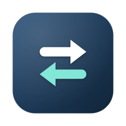

<p align="center">
  
</p>
<h1 align="center">AndroMac</h1>
<p align="center">
  <a href="https://github.com/anilmetin0/AndroMac/releases/latest"></a>
  <a href="https://github.com/anilmetin0/AndroMac/actions/workflows/build.yml"></a>
  <a href="LICENSE"></a>
  
</p>
<p align="center">Your Android phone and your Mac, kept in sync over your own Wi-Fi. No cloud, no account.</p>
<p align="center">
  <a href="https://github.com/anilmetin0/AndroMac/releases/latest">⬇️ Download</a>
  •
  <a href="docs/GUIDE.md">📖 Guide</a>
  •
  <a href="README.tr.md">🇹🇷 Türkçe</a>
</p>

<table>
<tr>
<td align="center" valign="top"></td>
<td align="center" valign="top"></td>
</tr>
</table>

# What is AndroMac?

AndroMac connects an Android phone to a Mac directly, over the local network. The Mac shows the
phone's battery, notifications, clipboard and music, sends files both ways, and can show the
phone's screen in a window. The two apps find each other over Bonjour, agree on a key once, and
from then on talk only to each other. There is no server in between.

It is built to cost the phone next to nothing: the phone runs no timer of its own, and the Mac
does the work that has to happen somewhere.

# Features

### Everyday
- Battery level, charging state and a low-battery warning in the menu bar
- Clipboard in both directions, with a searchable history on the Mac
- Notifications in Notification Center, with actions and inline reply, and a tier per app
- Media controls, ringer and volume, and a button that makes a lost phone ring
- Files in both directions, checked against SHA-256 before they are kept
- Screen mirroring with mouse, keyboard and sound, through the bundled [scrcpy](https://github.com/Genymobile/scrcpy)
- Several phones on one Mac, each with its own settings

### Private by design
- Local network only; the daily update check is the one request that leaves it, and one switch turns it off
- Noise-KK handshake over P-256 and AES-256-GCM, confirmed with a 6-digit code on both screens
- The crypto is written twice (CryptoKit and JCE), and two scripts prove the two agree
- No telemetry, no analytics, no third-party library in either app

The [guide](docs/GUIDE.md) covers every feature, the trust model and how AndroMac compares with
KDE Connect, LocalSend and Quick Share.

# Install

### Mac · Apple Silicon, macOS 14+

```bash
brew tap anilmetin0/andromac https://github.com/anilmetin0/AndroMac
brew trust anilmetin0/andromac
brew install --cask andromac
xattr -dr com.apple.quarantine /Applications/AndroMac.app
```

No Homebrew? Download the DMG from
[releases](https://github.com/anilmetin0/AndroMac/releases/latest), drag AndroMac to
Applications, then run the last line. It is needed once, because the app is not notarized.

### Android · 10+

Open [releases](https://github.com/anilmetin0/AndroMac/releases/latest) on the phone and tap
the APK. Or, with the phone connected over adb:

```bash
gh release download --repo anilmetin0/AndroMac --pattern '*-android.apk'
adb install AndroMac-*-android.apk
```

### Pair

1. Open AndroMac on both devices, on the same Wi-Fi.
2. On the phone, grant what the **Permissions** card lists, then tap **Pair**.
3. Check that both screens show the same six digits, and confirm on both.

Both apps update themselves from then on. Every step in detail, and troubleshooting, is in the
[guide](docs/GUIDE.md#install).

# Building

```bash
scripts/verify-crypto.sh && scripts/verify-handshake.sh   # the two implementations agree
macos/scripts/fetch-scrcpy.sh && macos/build.sh           # → macos/build/AndroMac.app
android/gradlew -p android :app:assembleDebug             # → the APK
```

You need Xcode 26.6+, JDK 25 and the Android SDK with platform 37. [CONTRIBUTING.md](CONTRIBUTING.md)
has the full toolchain, the tests and the rules every change has to keep. The wire format is in
[docs/PROTOCOL.md](docs/PROTOCOL.md) and the energy rules in [docs/ENERGY.md](docs/ENERGY.md).

# Licensing

AndroMac is licensed under the [MIT License](LICENSE). The Mac package also carries programs
distributed under their own licenses, listed with their sources in
[THIRD-PARTY-NOTICES.md](THIRD-PARTY-NOTICES.md):

- [scrcpy](https://github.com/Genymobile/scrcpy), licensed under the [Apache License 2.0](https://github.com/Genymobile/scrcpy/blob/master/LICENSE)
- [adb](https://android.googlesource.com/platform/packages/modules/adb/) from the Android Open Source Project, licensed under the Apache License 2.0
- [FFmpeg](https://ffmpeg.org/legal.html) and [libusb](https://github.com/libusb/libusb) inside scrcpy, licensed under the LGPL 2.1, and [SDL](https://github.com/libsdl-org/SDL), licensed under the zlib License

# Contributors

<a href="https://github.com/anilmetin0/AndroMac/graphs/contributors"></a>

Issues and pull requests are welcome; start with [CONTRIBUTING.md](CONTRIBUTING.md). Report a
security issue privately, as described in [SECURITY.md](SECURITY.md).

# Credits

Thanks to these projects, in no particular order:

- **[scrcpy](https://github.com/Genymobile/scrcpy)** by Genymobile and Romain Vimont, which does all of the screen mirroring
- **[Android Open Source Project](https://source.android.com/)** for adb and its wireless pairing
- **[KDE Connect](https://invent.kde.org/network/kdeconnect-kde)**, which showed what phone-to-computer integration can be, and whose 2025 pairing advisory shaped AndroMac's pairing code
- **[LocalSend](https://github.com/localsend/localsend)** for the offer-then-accept file flow
- **[Syncthing](https://github.com/syncthing/syncthing)** for the device-ID-from-key idea and its chunk-and-hash discipline
- **[The Noise Protocol Framework](https://noiseprotocol.org/)** by Trevor Perrin, the pattern the handshake follows
- **[Shizuku](https://github.com/RikkaApps/Shizuku)** for showing how to open Android's Wireless debugging switch directly
- **[Obtainium](https://github.com/ImranR98/Obtainium)** and **[Homebrew](https://brew.sh)**, which make installing and updating outside the stores easy
- *Everyone who tests, reports and uses AndroMac ❤️*
