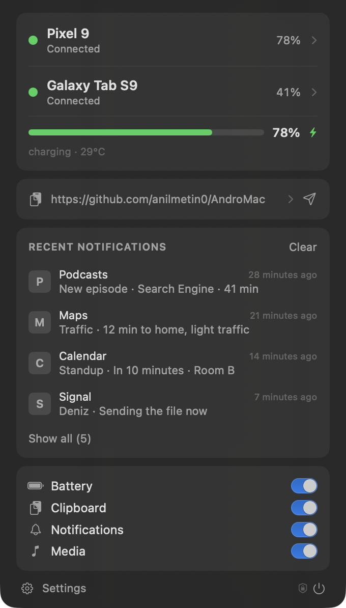
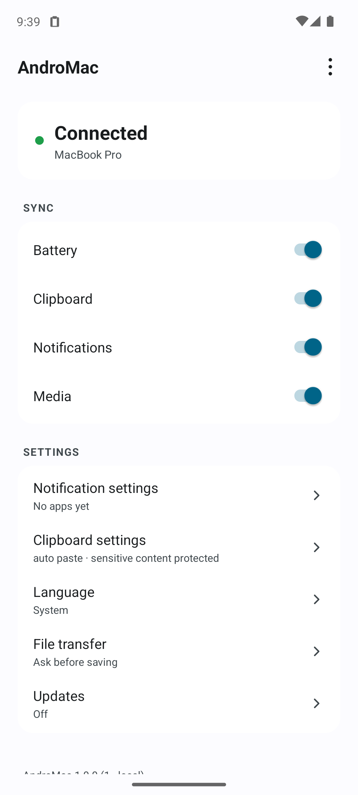
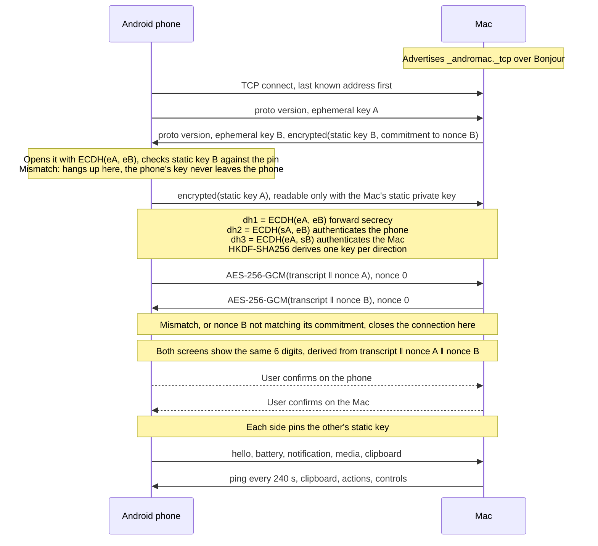
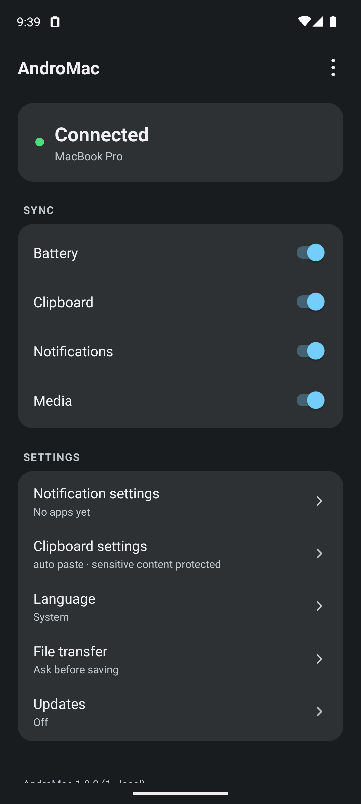
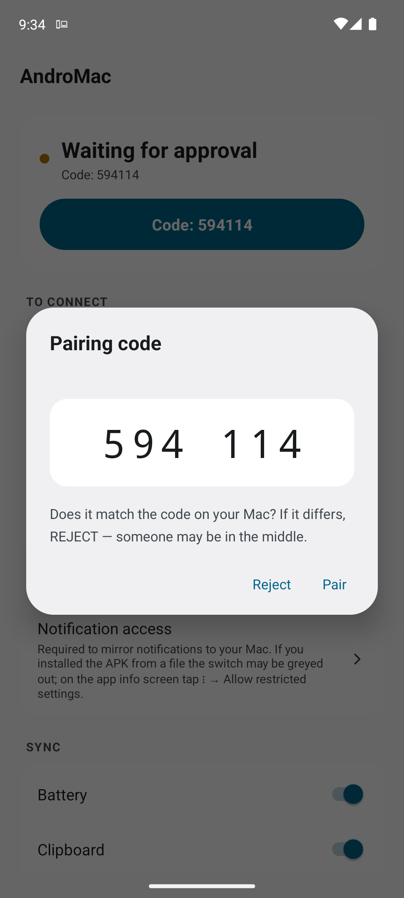
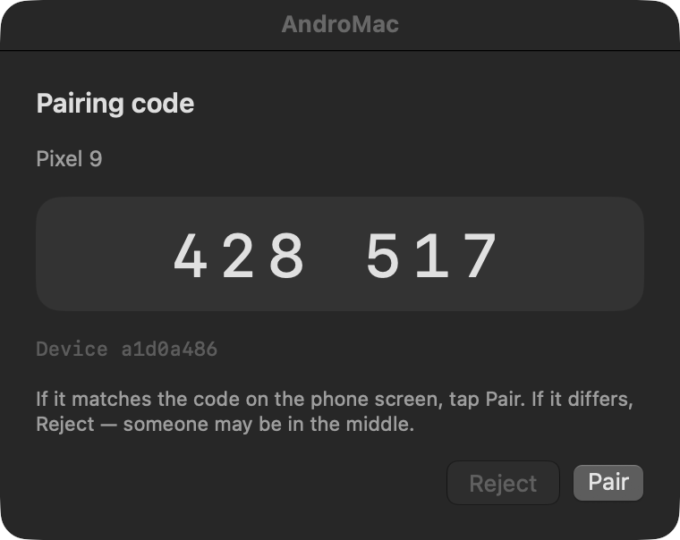
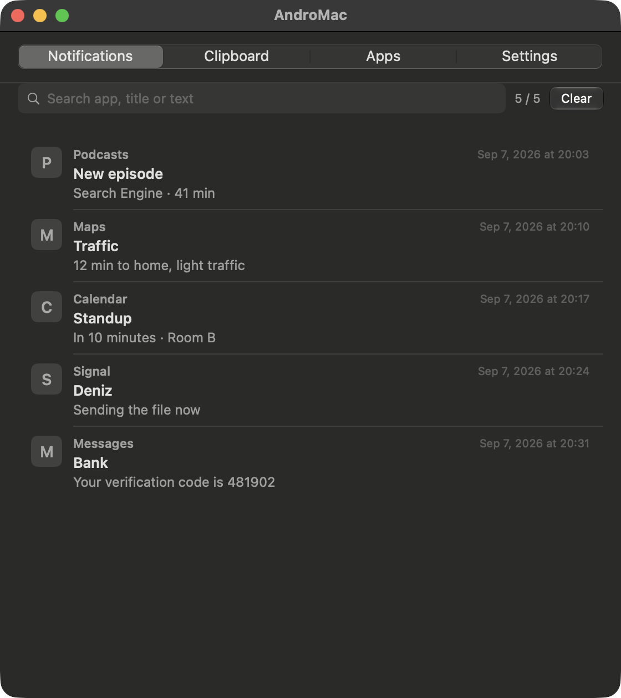
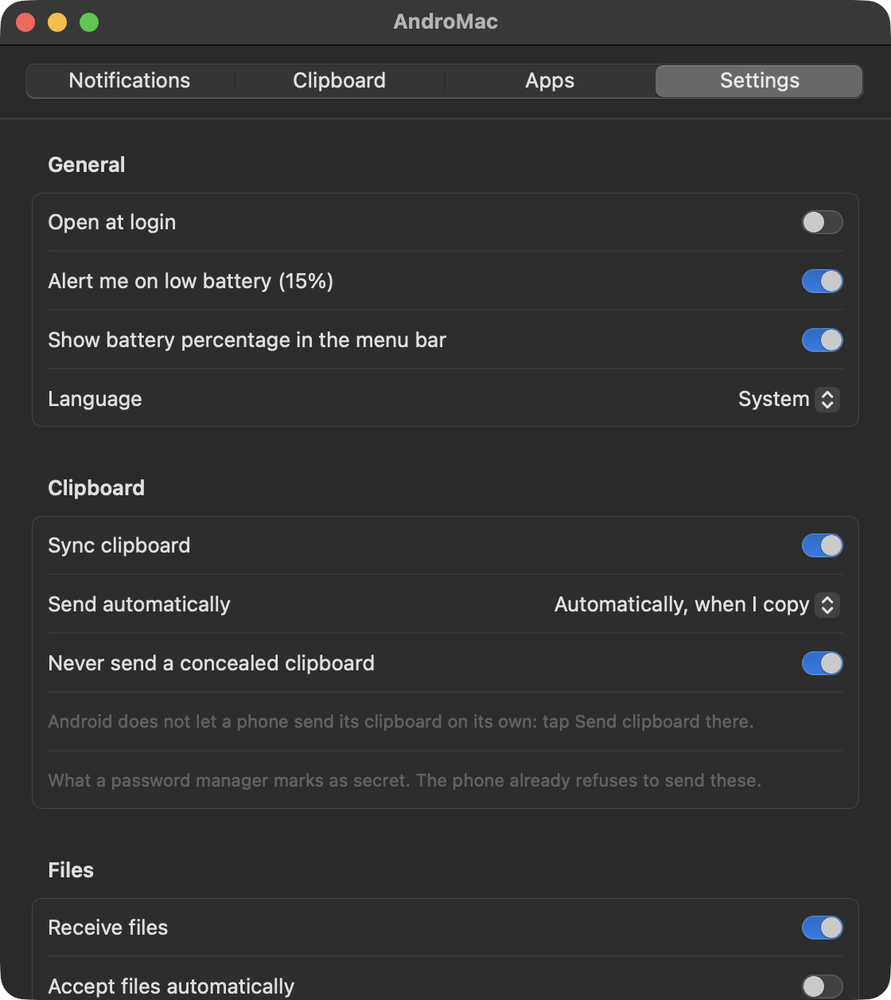

# AndroMac

AndroMac keeps an Android phone and a Mac in sync over your own Wi-Fi network and nothing else.
Battery level, clipboard in both directions, mirrored notifications you can act on and dismiss
from the Mac, per-app notification tiers, the track playing on the phone with transport controls,
and a button that makes a lost phone ring. There is no server, no account, no cloud and no
third-party library on either side: the two apps find each other over Bonjour, agree on a key, and
talk directly.

[](https://github.com/anilmetin0/AndroMac/actions/workflows/build.yml)
[](https://github.com/anilmetin0/AndroMac/releases/latest)
[](LICENSE)
[](#install)

🇹🇷 Türkçe: [README.tr.md](README.tr.md)

<table>
<tr>
<td width="45%" align="center">

</td>
<td width="30%" align="center">

</td>
</tr>
</table>

## Features

| Feature | Direction | What it does |
|---|---|---|
| **Battery** | Phone to Mac | Level, charging state and temperature. Optional percentage in the menu bar, a bar in the panel, and one warning when the level drops below 15%. |
| **Clipboard** | Mac to phone | Automatically as you copy, or only when you ask with the button in the panel — Settings → Clipboard holds the choice. A silent notification with a Paste action is the second route, for phones whose manufacturer blocks background clipboard writes. A clipboard marked concealed by a password manager is never sent. |
| **Clipboard** | Phone to Mac | One tap: the Quick Settings tile, the button on the ongoing notification, the share sheet, or the app itself. See [why this direction is manual](#why-the-clipboard-is-manual-in-one-direction). |
| **Clipboard history** | Mac | The last 50 entries from both directions. Search, click to copy, right-click to send back to the phone or delete. |
| **Notifications** | Phone to Mac | They arrive in Notification Center with the app's own icon. Actions, inline reply included, are triggered from the Mac, and dismissing on either device dismisses on the other. |
| **Per-app tiers** | Both ways | Full, Title only, or Off, set from either device. Applied on the phone: on Off the radio never wakes for that app, on Title only the body never leaves it. |
| **Noise filter** | Phone | Group summaries, ongoing and foreground-service notifications, local-only notifications and silent channels are dropped before sending. Mirroring can be limited to times when the phone is locked. |
| **Notification history** | Mac | The last 200 entries, searchable, stored only on the Mac. |
| **Media** | Both ways | Title, artist and app of the track playing on the phone, with previous, play/pause and next from the Mac. Sent only on change, with no progress bar. |
| **Find my phone** | Mac to phone | The phone rings at alarm volume and vibrates for at most 30 seconds. Found it, a second request, or the timeout stops it. |
| **Files** | Both ways | Share from the phone's share sheet, or **Send file…** and drag-and-drop on the Mac panel. The receiver is asked first, unless you turn on auto-accept — which then applies to every paired phone. Files land in Downloads, are checked against a SHA-256 hash, and are never opened for you. See [how it compares](#compared-with-other-tools). |
| **Several phones** | Mac | More than one Android can be paired and connected at once. The panel lists every device and expands on click; each one can be paused and resumed on its own — pausing hangs up as well as refusing the next attempt — and each has its own clipboard switch. Forgetting a device is in Settings → Devices. |
| **Verification codes** | Mac | When a mirrored notification carries a one-time code, the panel puts the code itself on a copy button. Copying it does not send it back to the phone and does not enter the clipboard history. |
| **Connection guide** | Both | Neither app says "cannot connect". Both show which step is stuck, and the phone has a live diagnostics screen. |
| **Metrics** | Mac | Messages per hour, traffic, reconnect count and the most frequent message types, so the energy claim can be checked rather than trusted. |

Deliberately out of scope: SMS, call control, more than one Mac, and access over the internet.
Any number of phones, one Mac, one local network.

### Why the clipboard is manual in one direction

Since Android 10 an app cannot read the clipboard unless it is in the foreground. That is a
deliberate privacy decision with no supported way around it, so the phone to Mac direction is
user-triggered. The share sheet route never touches the clipboard at all, which makes it the
cleanest of the four.

## How it works

The Mac is the server. It advertises `_andromac._tcp` over Bonjour on a port the system assigns.
The phone is the client: it tries the last address that worked, and only browses for the service
when that fails.



### The trust model

The handshake is a Noise-KK pattern over NIST P-256. Each device has one long-term key pair and
generates a fresh ephemeral pair per session, so a session that is recorded today cannot be
decrypted later even if a device is compromised. Only the ephemeral keys are ever sent in the
clear. The Mac's long-term key travels encrypted under the ephemeral secret, and the phone
sends its own only after checking the Mac's against the pin, encrypted so that only the real
Mac can read it. A listener on the network sees two random per-session keys, and a stranger
answering on the port learns nothing about the phone. The three Diffie-Hellman results are mixed
with a transcript hash through HKDF-SHA256 into one AES-256-GCM key per direction, and both
sides then encrypt the transcript and check what the other sent. A mismatch closes the
connection before any application message is read.

Nothing above proves *which* devices are talking, only that nobody is in the middle of this
particular exchange. That is what the 6-digit code is for. It is derived from the whole
handshake transcript plus one random nonce from each side, and the Mac commits to its nonce
with a hash before the phone reveals its own. A device in the middle has to fix its half of each
code before it can see the other half, so it gets one guess in a million per attempt, and every
failed attempt is a visible mismatch on your screens. A code derived from the static keys alone
would not have this property: the attacker could grind key pairs offline until both screens
agreed, which is the class of weakness KDE Connect fixed in 2025. Compare the digits, confirm on
both devices, and each side pins the other's static public key permanently.

From then on the pin is the check. On the phone, which pins exactly one Mac, this is absolute; on the Mac, which pins a set of phones, a key it has not met is simply an unknown device and gets an ordinary first-contact prompt. A key that does not match byte for byte is rejected and
reported as a changed key, never accepted silently and never quietly re-pinned, and tapping Pair
again does not clear it. If you see that warning without having reinstalled either app, something
is wrong and you should reject it. Rejecting a code on the Mac also mutes that key for a
growing while, one minute doubling up to an hour, so a stranger cannot turn the prompt into a
nag. The Bonjour record carries no key and plays no part in this decision; only the key proven
during the handshake does. The same goes for names: the name in the Bonjour record is only used
to find the Mac, and the name shown after connecting comes from inside the encrypted session.

The full wire format is in [docs/PROTOCOL.md](docs/PROTOCOL.md).

### Compared with other tools

Before adding file transfer, the trust models and transfer protocols of Syncthing, LocalSend,
KDE Connect, Quick Share, AirDrop, Magic Wormhole and Blip were read side by side. Where a design
had a documented weakness or a published advisory, AndroMac does it differently on purpose.

| Question | Elsewhere | AndroMac |
|---|---|---|
| Who can talk to the app? | LocalSend accepts a transfer from any device on the LAN behind an optional PIN; its fingerprint is remembered, never verified ([issue #162](https://github.com/localsend/localsend/issues/162)). KDE Connect and Syncthing accept unauthenticated discovery packets and decide trust later. | Only the one pinned key can complete a handshake. There is no per-transfer PIN because pairing is the PIN, and discovery is a hint the handshake has to prove. |
| Can the code shown at pairing be forged? | KDE Connect's 8-hex-character code was a hash of the two certificates and could be brute-forced ([advisory, April 2025](https://kde.org/info/security/advisory-20250418-3.txt)); the fix mixes in a timestamp. | The code is bound to a fresh transcript and to nonces exchanged under a commitment, so it cannot be ground offline and every attempt costs a visible mismatch. |
| Is the shown device name trustworthy? | KDE Connect displayed the name from the cleartext discovery packet even for paired peers, so it could be spoofed. AirDrop broadcasts hashes of your phone number and e-mail to anyone nearby, reversible in milliseconds ([PrivateDrop, USENIX 2021](https://privatedrop.github.io/)). | The name shown after connecting comes from the encrypted `hello`. The Bonjour record carries a name and the protocol version — no key, and nothing tied to an account or a person. |
| What happens before you press Accept? | Quick Share processed payload frames before the accept response, which chained into remote code execution ([CVE-2024-38272](https://www.safebreach.com/blog/rce-attack-chain-on-quick-share/)). LocalSend's Quick Save accepts from anyone. | Nothing is written to disk before `file_accept`; a chunk for an unaccepted id is dropped without allocating. Auto-accept exists, but only for the pinned device. |
| Is the file checked? | KDE Connect relies on TLS alone, no application-layer hash. Syncthing hashes every block. LocalSend's hash is optional. | Every chunk is bounded (512 KiB) and the whole file is verified against SHA-256 before it is renamed into place; until then it is a `.part` file or a pending media entry. |
| What about the file name? | Quick Share's chain included a path traversal on the receiver. AirDrop appends " 2" after the extension for unknown types. | The receiver keeps only the last path component, strips control characters and leading dots, caps the length, and numbers duplicates before the extension. |
| Is the received file opened? | KDE Connect has an `open` flag that launches the file on arrival. | Never. macOS marks it with the same quarantine flag a browser download gets; Android puts it in Downloads through MediaStore, so the app needs no storage permission. |
| Can a stranger exhaust the app? | KDE Connect could be held open with unauthenticated connections ([CVE-2020-26164](https://nvd.nist.gov/vuln/detail/CVE-2020-26164)). | Four pending handshakes at most, 10 seconds each, one pairing prompt per 30 seconds, one transfer at a time per direction, and window-1 flow control so a peer cannot grow the phone's heap. |
| Does anything leave the LAN? | Blip and Magic Wormhole relay through the internet when a direct path fails; Syncthing has global discovery and relays. | Never. There is no relay to fall back to. |

What was borrowed rather than fixed: LocalSend's offer-then-accept flow with a per-transfer id,
Syncthing's chunk-and-hash discipline and temp-file-then-rename, Quick Share's idea of a short
number confirmed on both screens, and the accept dialog that names the sender and the size before
anything happens. Magic Wormhole's password-authenticated key exchange is excellent for two
strangers, and unnecessary here: with pinned long-term keys, mutual authentication is already
solved, and a per-transfer code would only add taps.

What the network still sees: the Mac's name in its Bonjour record, and the fact that a phone
connected to it. Both long-term keys are encrypted in the handshake, so a passive listener
cannot tell *which* phone, and an active one only learns the Mac's key, which is the price of
being the discoverable side. That is a random key, not a name or an account.

## Install

Prebuilt packages are on the [releases page](https://github.com/anilmetin0/AndroMac/releases/latest):
`AndroMac-<version>-<commit>-macOS.zip` and `AndroMac-<version>-<commit>.apk`. Checksums are in
`SHA256SUMS.txt` next to them.

### macOS 14 Sonoma or later

1. Unzip and move `AndroMac.app` to **Applications**.
2. The app is signed ad-hoc, not notarized, so macOS blocks the first launch. Open it once, let it
   be refused, then go to **System Settings → Privacy & Security** and press **Open Anyway**.
   From the terminal instead:

   ```bash
   xattr -dr com.apple.quarantine /Applications/AndroMac.app
   ```
3. On first launch answer **Always Allow** to the Keychain prompt, which is where the identity key
   is stored, and **Allow** to the Local Network prompt, without which the phone cannot be found.
4. AndroMac has no Dock icon. It lives in the menu bar; click the phone silhouette to open the
   panel.
5. Optional: Settings → General → **Open at login**.

With [Homebrew](https://brew.sh) the same thing is two commands. The tap lives in this repository,
so it is added by URL:

```bash
brew tap anilmetin0/andromac https://github.com/anilmetin0/AndroMac
brew install --cask andromac                    # current build
brew install --cask --no-quarantine andromac    # same, without the Open Anyway step
```

The cask has no fixed version: it asks the release API for the current build, so it upgrades
with `brew upgrade --cask --greedy-latest andromac` rather than plain `brew upgrade`.

### Android 10 or later

1. Copy the APK to the phone and tap it in a file manager. Android will ask you to allow
   installation from that app.
2. Open AndroMac. The **Setup** section asks for what it needs:
   - **Notification permission**, so the app can show its own ongoing and clipboard notifications.
   - **Notification access**, for notification mirroring and for reading the media session.
   - **Battery optimization exemption**, so the system does not cut the connection while the
     screen is off.
3. On Android 13 and later the notification access toggle is greyed out for sideloaded apps, with
   a message about restricted settings. Try it once so the system registers the attempt, then go
   to **Settings → Apps → AndroMac → ⋮ → Allow restricted settings** and try again.
4. The Setup section disappears by itself once everything is granted.

[Obtainium](https://github.com/ImranR98/Obtainium) installs and updates the APK straight from
the releases page. Add `https://github.com/anilmetin0/AndroMac` as an app, or open this link on
the phone: [obtainium://add/github.com/anilmetin0/AndroMac](obtainium://add/https://github.com/anilmetin0/AndroMac).
The release APK is signed with one key across versions, so updates install in place. Obtainium
keys on the tag name, which stays the same while a version is in development, so it will not
notice a new build of the same version unless its **release date as version string** option is
on. The in-app update check below compares the commit and does notice.

### Update check

Neither app checks for updates unless you turn it on. **Settings → Updates** on both sides has the
switch and a **Check now** button. When on, the app asks the GitHub releases API for the newest
release at most once a day, only at launch and when the menu bar panel is opened. When a newer build exists, a greater
version or the same version built from a different commit, it shows a row with the version and
commit, as in `1.0.0 (fd7d47a)`, and a link to the release page. It never downloads or installs
anything by itself. Turning the switch on is the one thing that makes the apps talk to a server,
see [Privacy and security](#privacy-and-security).

## Pairing

1. Open AndroMac on the Mac, and make sure both devices are on the **same Wi-Fi network**.
2. Tap **Pair** on the phone.
3. The same 6 digits should appear on both screens. If they match, confirm on both. If they do
   not, reject: it means the exchange was intercepted.

After that it is automatic. The phone reconnects on its own whenever the network comes back.

While unpaired, both apps show a guide with the live state of every step, so you can see which one
is stuck instead of guessing:

| Step | On the phone | On the Mac |
|---|---|---|
| Is the app open on the Mac | `Mac seen on the network` or `not found` | `This Mac is advertising` |
| Same network | `Phone: 192.168.1.42` | `This Mac: 192.168.1.5` |
| Pair | `Ready` or `Complete the previous steps` | Waiting for the phone |

If it still will not connect, **I can't connect** at the bottom of that guide opens live
diagnostics: the phone's address and subnet, whether the Mac was seen, the pairing and connection
state, and the app version, followed by a list of fixes per symptom. Settings → Network on the Mac
shows the same information and links straight to the Local Network permission.

The Mac's pairing dialog and the phone's both show the digits in large groups. On the phone, a key
that changed rather than being new defaults to **Reject**. On the Mac the first phone defaults to
**Pair** and every later request defaults to **Reject**, because an unexpected phone is the
suspicious case.

## Screenshots

<table>
<tr>
<td align="center">

</td>
<td align="center">

</td>
<td align="center">

</td>
</tr>
<tr>
<td colspan="3" align="center">

</td>
</tr>
<tr>
<td colspan="3" align="center">

</td>
</tr>
</table>

## Settings

The phone's main screen stays plain: connection status, four sync switches for **Battery**,
**Clipboard**, **Notifications** and **Media**, two detail lines, and the version at the bottom.
Both apps write the version the same way, as `1.0.0 (12 · abc1234)`: version, build number and
the commit it was built from. Quote that whole string in a bug report. Everything else is one
level down.

| Screen | What is on it |
|---|---|
| Notification settings | **App filter** with a summary of what is set, **Silent notifications**, and **Only while the phone is locked**. It also lists what is always filtered out. |
| App filter | The three-tier picker for every app the phone has seen, reached from Notification settings. |
| Clipboard settings | Incoming: **Write to the clipboard**, **Show a notification**. Outgoing: **Never send sensitive content**. Plus **Send clipboard to Mac**. |
| Connection help | Live diagnostics, common problems, and how the whole thing works. Reached through **I can't connect** in the pairing guide. |
| Updates | The opt-in update check: switch, **Check now**, and a download link when a newer build exists. |
| Files | **Receive files** and **Accept files automatically**. Received files go to Downloads; sending is done from any app's share sheet. |
| Language | Opens the Android per-app language picker, which offers English and Turkish. |
| ⋮ menu | Unpair. |

On the Mac the menu bar panel is for glancing. It shows, in order, a card with every paired phone — each
row expandable, carrying that phone's track, its clipboard switch, a ring button and Pause — with
battery underneath, then the last clipboard entry with a progress row while a file is moving in
either direction, the four most recent notifications, and the four sync switches. A status line
appears above all of it only when nothing is paired yet or the listener is down. Dropping files onto the panel sends them. The
detail lives in the window.

| Tab | What is on it |
|---|---|
| Notifications | The history, with search and a clear button. |
| Clipboard | The history, with search, click to copy, right-click to send back or delete. |
| Apps | The tier picker for every app on the phone. |
| Settings | General, Clipboard, Files, Updates, Devices, Network, Metrics and Privacy. |

Settings → General has **Open at login**, **Alert me on low battery (15%)**, **Show battery
percentage in the menu bar**, and a **Language** picker offering System, English and Turkish.
Changing the language shows a Restart button, because the language is read at launch. Updates holds
the opt-in update check described under [Update check](#update-check). Files has
**Receive files** and **Accept files automatically**, the latter for every paired phone. Clipboard
holds the sync switch, the **Mac to phone** choice between automatic and manual, and the concealed
clipboard rule. Updates also draws a QR code for the releases page, so the APK can be installed on
the phone without typing a URL. Devices lists every paired phone with its status and holds **Forget**
for each, plus **Forget all devices** when more than one is paired; this Mac's name and the app
version are there too. Network shows both
addresses with a shortcut to the Local Network permission. Metrics is described under
[Energy](#energy). Privacy states plainly what is stored and where.

## Privacy and security

**Nothing leaves the local network.** There is no server to reach, no account to create, no
telemetry and no analytics. The apps open no socket to the internet, with one opt-in exception:
the update check in Settings → Updates, off by default, which asks `api.github.com` for the newest
release at most once a day and sends nothing but the app's version in the `User-Agent` header.

What leaves the phone depends on the tier you set per app. On Off, nothing at all, and the radio
does not even wake. On Title only, the app name and nothing else: the title, the body and the
action names are sent empty, so the content never leaves the device rather than being trimmed on
arrival. On Full, the title, body and action names. Clipboard content that a password manager or
an OTP field marked with `EXTRA_IS_SENSITIVE` is never sent, which is on by default. The Bonjour
record carries only the device name and the protocol version, and no key material.

Where things are stored:

| What | Where |
|---|---|
| The Mac's identity key | The macOS Keychain |
| The phone's identity key | Wrapped with an AES-256-GCM key that lives in the Android Keystore and cannot be exported. It is unwrapped into memory during the key exchange, which is the ceiling of doing P-256 in software |
| The pinned peer key, the device name and settings | Locally on each device |
| Notification and clipboard history | Only on the Mac, under Application Support. Deleted when you unpair |

Files are the one thing that is written to disk on purpose. A transfer starts only after the
receiver accepted it, or after you turned on auto-accept, which applies to every paired phone; nothing is
written before that. The file is verified against its SHA-256 hash before it gets its final
name, is never opened for you, and on the Mac carries the same quarantine flag as a browser
download. The name is sanitized on arrival, so a sender cannot pick the directory.

On the wire: P-256 key agreement, HKDF-SHA256, AES-256-GCM with a per-direction counter as the
nonce, so a replayed frame closes the connection. Frames are capped at 1 MiB, and the receiver
enforces its own length limit on every field rather than trusting the sender. The Mac gives a
connection 10 seconds to finish its handshake, holds only a few unverified connections at a time,
rate-limits the pairing prompt, rejects peers outside private address ranges, and gives up an
established session only after a new connection has completed its handshake. Another device on
your Wi-Fi cannot knock your phone offline by opening a socket. No log line carries message
content or key material.

### Verifying it yourself

The crypto is written twice, independently: CryptoKit on macOS, JCE on Android. That the two agree
is proven rather than assumed, by two scripts that also run in CI on every push:

```bash
./verify-crypto.sh       # identical vectors: key encoding, HKDF, nonce layout, GCM tag, SAS
./verify-handshake.sh    # the real Swift and Kotlin session code, over loopback
```

The first compares the two implementations vector by vector. The second runs the actual
`Session.accept` in Swift against the actual `Session.connect` in Kotlin and checks the frame
order, the confirmation round, the pin check, that the 6-digit code matches on both sides, and
that 12 frames arrive in counter order in each direction.

Both exist because passing one does not imply the other. During development the vectors matched
while the handshake failed, because the second and third Diffie-Hellman operations were ordered
the wrong way round on macOS.

To report a vulnerability, use private reporting as described in [SECURITY.md](SECURITY.md), not a
public issue.

## Energy

What drains a phone battery is not the amount of data, it is how often the radio wakes up. So the
phone sets up no periodic timer at all. The Mac is on wall power, so the Mac does the liveness
check with a ping every 240 seconds and the phone only answers. Battery reports ride on a
broadcast the system already sends, at most once a minute. Notifications and media are
event-driven with short coalescing windows. Filtering happens on the phone, before the radio
wakes, and the mDNS browse stops the moment a connection is up.

The whole rule set, and how to measure it with `dumpsys batterystats`, is in
[docs/ENERGY.md](docs/ENERGY.md). Settings → Metrics on the Mac should show roughly 30 messages
per hour for each connected phone when idle. Noticeably more means one of the rules has been broken.

## Building from source

You need macOS 14 or later, Xcode 26.6 or later for the Swift 6.2 toolchain, JDK 25, and the
Android SDK with platform 37 and build-tools 36.0.0. Gradle 9.7.1 arrives through the wrapper.
There is no Xcode project: the macOS side is a Swift package that `build.sh` assembles into an
app bundle.

`JAVA_HOME` is used if it is set. Otherwise the scripts pick the newest JDK 25 that `java_home`
reports, and fall back to the default JDK.

```bash
./verify-crypto.sh && ./verify-handshake.sh          # proof first

macos/build.sh                                       # → macos/build/AndroMac.app
open macos/build/AndroMac.app

android/gradlew -p android :app:installDebug         # phone attached over adb

(cd macos && swift test)                             # unit tests, macOS side
android/gradlew -p android :vectors:test             # unit tests, JVM side
```

`build.sh` signs the bundle ad-hoc, which produces a different identity on every build, so the
Keychain asks on every launch. With a persistent certificate it asks once:

```bash
CODESIGN_IDENTITY="Apple Development: you@example.com" macos/build.sh
```

If you decline the Keychain prompt the app does not generate a replacement key. It runs with a
temporary one and says so in the panel, rather than silently breaking your pairing.

To watch a live connection, `adb logcat -s AndroMac` on the phone and
`log stream --predicate 'senderImagePath CONTAINS "AndroMac"'` on the Mac. Neither carries message
content.

## Releases

Every push and pull request runs the same pipeline: both verification scripts, the Swift and JVM
unit tests, the localization completeness check, a lint of the Homebrew casks, the macOS app
bundle and the Android APK.

Pushes to `main` also publish. The product is in development and stays at the version in the
`VERSION` file, and every push re-publishes one rolling release for it: the tag is `v1.0.0`, the
title `AndroMac 1.0.0 (fd7d47a)`, and the assets carry the version and the commit in their
names. The notes are the `## <version>` section of `CHANGELOG.md`, with the matching section of
`CHANGELOG.tr.md` folded underneath, followed by the commits since the previous build. The
release fails if either section is missing.

A new version starts with one commit that raises `VERSION` and adds a matching section to both
changelogs. That freezes the old release and the next push starts a new rolling one. The full
checklist is in [docs/RELEASING.md](docs/RELEASING.md).

The APK is signed with a release keystore taken from repository secrets. Without those secrets the
build falls back to the debug key and prints a warning: the APK installs, but it cannot be
upgraded in place by a later release, because the runner's debug key is regenerated every run.
`scripts/setup-android-signing.sh` generates a keystore, keeps it and its password outside the
repository, and uploads the four secrets the workflow expects. Back that keystore up; losing it
closes the upgrade path.

The macOS app is not notarized, which needs a paid Developer ID. That is why the install steps
above exist.

## Repository layout

```
VERSION                            the current version; every push republishes its release
CHANGELOG.md, CHANGELOG.tr.md      release notes, read by the release job
verify-crypto.sh                   proves the two crypto implementations agree, vector by vector
verify-handshake.sh                runs the real Swift and Kotlin session code over loopback
scripts/setup-android-signing.sh   creates the APK signing key and uploads it as secrets
Casks/andromac.rb                  Homebrew cask, resolves the current build from the release API
.github/workflows/build.yml        verify, test, build both apps, publish the release
.github/dependabot.yml             weekly updates for the actions and the Gradle plugins

docs/PROTOCOL.md                   the wire protocol both sides are written against
docs/ENERGY.md                     the energy rules, where each lives, and how to measure them
docs/RELEASING.md                  the release checklist and what the pipeline does with it

android/                           AGP 9.4.0, Gradle 9.7.1, minSdk 29, no dependencies
  app/src/main/AndroidManifest.xml
  app/src/main/kotlin/dev/andromac/
    core/Crypto.kt                 P-256, HKDF and AES-GCM on plain JCE, no Android API
    core/Session.kt                the handshake as initiator, plus encrypted framing
    core/Protocol.kt               message builders and constants
    core/Store.kt                  identity key, pin, per-app tiers, settings
    core/Version.kt                version parsing and ordering, by version then commit
    core/FileNames.kt              file-name sanitization and duplicate numbering, pure Kotlin
    core/Link.kt                   connection state and the single-threaded send queue
    core/NetworkInfo.kt            the phone's address and subnet, for the guide
    net/LinkService.kt             foreground service: connect loop, backoff, dispatch
    net/Discovery.kt               mDNS, only while there is no connection
    net/BootReceiver.kt            starts the service at boot, only when paired
    feature/NotificationRelay.kt   the mirror: structural filter, tier, coalescing
    feature/AppModeSync.kt         sends the tier list to the Mac
    feature/BatteryReporter.kt     battery, on 1% or charging change, at most once a minute
    feature/ClipboardBridge.kt     clipboard both ways, with the sensitive-content check
    feature/ClipTile.kt            the Quick Settings tile
    feature/MediaBridge.kt         the active media session, and controls from the Mac
    feature/FindPhone.kt           alarm, vibration and the Found it notification
    feature/IconProvider.kt        app icons, once per package
    feature/AppLabel.kt            package name to display name
    feature/UpdateCheck.kt         the opt-in release check against the GitHub API
    feature/FileTransfer.kt        file send and receive: offer, consent, chunks, hash, MediaStore
    ui/MainActivity.kt             status, pairing, the guide, the sync switches
    ui/HelpActivity.kt             live diagnostics and troubleshooting
    ui/UpdateSettingsActivity.kt   the update switch and Check now
    ui/FileSettingsActivity.kt     receive files and auto-accept
    ui/NotificationSettingsActivity.kt, ui/ClipboardSettingsActivity.kt, ui/AppsActivity.kt
    ui/ShareActivity.kt            the share-sheet target: text to the clipboard, files to FileTransfer
    ui/ClipActivity.kt             invisible helper for clipboard reads
    ui/SettingsRows.kt, ui/Insets.kt
  app/src/main/res/
    values/strings.xml             English, the base language
    values-tr/strings.xml          Turkish
    xml/locales_config.xml         what the per-app language picker offers
  vectors/                         runs Crypto, Session and Protocol on a plain JVM
    src/test/                      JVM unit tests for Version, UpdateCheck and FileNames

macos/                             Swift package, swift-tools 6.2, macOS 14+, no dependencies
  Package.swift
  build.sh                         builds and packages the .app, sets the version, signs it
  scripts/update-strings.sh        extracts the localization keys and rewrites the .strings files
  Resources/Info.plist
  Resources/Localization/          en.lproj and tr.lproj
  Resources/make-icon.swift        generates the app icon, so no binary lives in the repo
  Sources/AndroMacKit/
    Crypto.swift                   the same crypto, on CryptoKit
    Session.swift                  the handshake as responder, plus encrypted framing
    Wire.swift                     length-prefixed frames over NWConnection
    Version.swift                  version parsing and ordering, by version then commit
    FileNames.swift                file-name sanitization, duplicate numbering and chunk math
    PairedDevice.swift             one trusted phone as it is written to disk, keyed by its static key
    VerificationCode.swift         finds the one-time code in a notification, for the copy button
    ReleaseInfo.swift              the release the update check compares against
  Sources/AndroMac/
    AndroMacApp.swift              the menu bar item, the window and the pairing dialog
    Server.swift                   Bonjour, handshake limits, the session, ping, dispatch
    AppState.swift                 the single state the UI reads
    Store.swift                    Keychain identity, pin, settings, open at login
    UpdateCheck.swift              the opt-in release check against the GitHub API
    FileTransfer.swift             file send and receive: offer, consent window, chunks, hash, quarantine
    MenuPanel.swift                the menu bar panel
    DeviceList.swift               every paired phone, expandable, with its clipboard switch and Pause
    Theme.swift                    fonts, spacing and the platform surfaces the UI is built from
    DemoMode.swift                 invented data for the screenshots, off unless ANDROMAC_DEMO=1
    PanelComponents.swift          the guide step, the media row, the notification row
    MainWindow.swift               the four tabs
    PairingWindow.swift            the 6-digit code
    HistoryList.swift, ClipboardList.swift, AppsList.swift, SettingsList.swift, SharedViews.swift
    NotificationMirror.swift       Notification Center: categories, reply, mute, battery alert
    NotificationHistory.swift, ClipboardHistory.swift, IconCache.swift, AppModes.swift
    ClipboardWatcher.swift         clipboard polling, only while connected, with an echo breaker
    LinkStats.swift                the metrics
    NetworkInfo.swift              this Mac's address
  Sources/SelfTest/                the vector printer and handshake responder the scripts use
  Tests/AndroMacKitTests/          Swift Testing unit tests
```

## Troubleshooting

| Symptom | What to check |
|---|---|
| The phone says the Mac was not found | AndroMac is open on the Mac; both devices are on the same Wi-Fi, not a guest network and not one with AP isolation; the Local Network permission was granted, reachable from Settings → Network on the Mac. |
| It connects, then drops | The battery optimization exemption on the phone, and AP isolation on the router. |
| Notifications do not arrive | Notification access, including the Android 13+ restricted settings flow; the app may be on the Off tier; silent notifications are not sent by default. |
| A "key changed" warning on the phone | Expected if you reinstalled the Mac app: unpair on the phone and pair again. If you did not, reject it. A reinstalled phone instead arrives on the Mac as a new device, and the old entry stays until you forget it. |
| The Keychain asks on every launch | An ad-hoc signature changes on every build. Use the release package, or build with `CODESIGN_IDENTITY`. |
| The clipboard does not arrive from the phone by itself | That is the Android restriction described above. Use the tile, the notification button, or the share sheet. |
| No track shows on the Mac while music is playing | The media session is read through notification access, so grant that first. The Media switch must also be on. |

**I can't connect** on the phone is the live version of this table. It sits in the pairing guide,
which the phone shows while it is unpaired.

## Contributing

[CONTRIBUTING.md](CONTRIBUTING.md) covers the toolchain, the two verification scripts, the energy
contract every change has to keep, and how to add a language, which is one file per platform and
no code change.

Licensed under the [MIT License](LICENSE).
