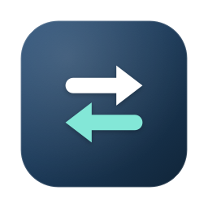
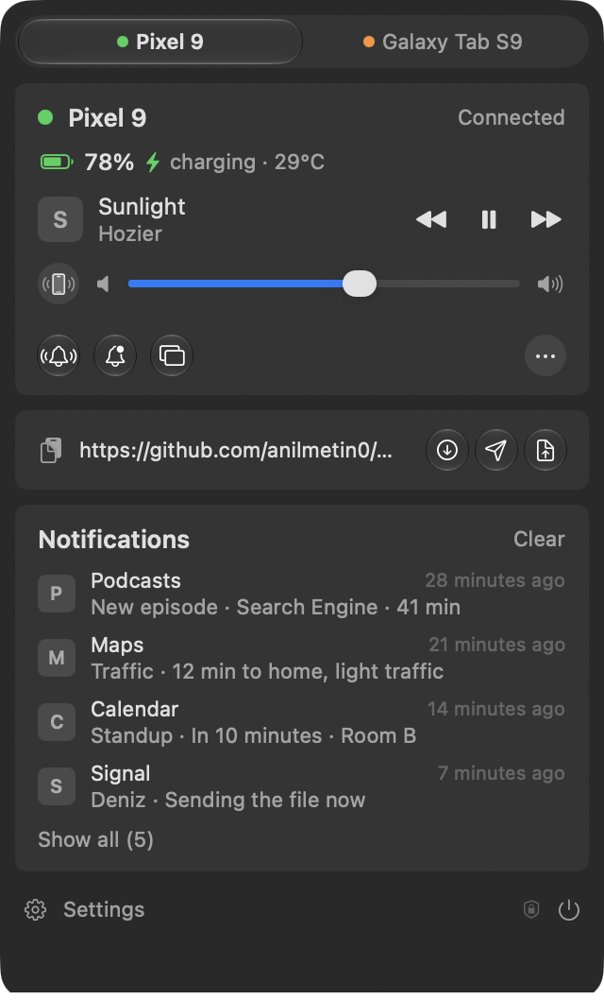

<p align="center">
  
</p>
<h1 align="center">AndroMac</h1>
<p align="center">
  <a href="https://github.com/anilmetin0/AndroMac/releases/latest"></a>
  <a href="https://github.com/anilmetin0/AndroMac/actions/workflows/build.yml"></a>
  <a href="LICENSE"></a>
  
</p>
<p align="center">Your Android phone and your Mac, kept in sync over Wi-Fi.</p>
<p align="center">
  <a href="https://github.com/anilmetin0/AndroMac/releases/latest">⬇️ Download</a>
  •
  <a href="docs/GUIDE.md">📖 Guide</a>
  •
  <a href="README.tr.md">🇹🇷 Türkçe</a>
</p>

<p align="center">
  
  &nbsp;&nbsp;
  
</p>

# What is AndroMac?

AndroMac connects an Android phone to a Mac over the local network. The Mac shows the
phone's battery, notifications, clipboard and music, sends files both ways, and can show the
phone's screen in a window.

# Features

- Battery level, charging state and a low-battery warning in the menu bar
- Clipboard in both directions, with a searchable history on the Mac
- Notifications in Notification Center with the app's icon and any picture they carry, actions, inline reply and a setting per app
- Media controls, ringer and volume, and a button that makes a lost phone ring
- Files in both directions, by drag and drop on the Mac or the share sheet on the phone
- Screen mirroring with mouse, keyboard and sound, through the bundled [scrcpy](https://github.com/Genymobile/scrcpy)
- Several phones on one Mac, and several Macs on one phone
- Disconnect and reconnect from the phone's notification, the Connection screen or a Quick Settings tile
- Updates that install themselves, through Homebrew when it installed the app, with an optional nightly channel

The [guide](docs/GUIDE.md) explains each feature and setting, and what to do when something does
not work.

# Install

### Mac, with Homebrew

Apple Silicon, macOS 14 or later. Paste this into Terminal:

```bash
brew tap anilmetin0/andromac https://github.com/anilmetin0/AndroMac
brew trust anilmetin0/andromac
brew install --cask andromac
xattr -dr com.apple.quarantine /Applications/AndroMac.app
```

The app is not notarized, so the `xattr` line is needed once to let macOS open it. After that the
app updates itself, and `brew upgrade --cask andromac` works too.

To get every new build, install `andromac@nightly` instead. The app then follows the nightly
builds. Installing one cask removes the other.

### Mac, without Homebrew

Download `AndroMac-<version>-macOS-arm64.dmg` from [releases](https://github.com/anilmetin0/AndroMac/releases/latest), drag AndroMac to
Applications, then run:

```bash
xattr -dr com.apple.quarantine /Applications/AndroMac.app
```

### Android

Android 10 or later. On the phone, open [releases](https://github.com/anilmetin0/AndroMac/releases/latest) and tap
`AndroMac-<version>-android.apk`. [Obtainium](https://github.com/ImranR98/Obtainium) can install
and update it from the same page. Or install it from a Mac with the phone connected over adb:

```bash
gh release download --repo anilmetin0/AndroMac --pattern '*-android.apk'
adb install AndroMac-*-android.apk
```

### Pair

1. Open AndroMac on both devices. They need to be on the same Wi-Fi.
2. On the phone, grant what the Permissions card asks for, then tap Pair.
3. Pick your Mac from the list. It shows each Mac's name and IP address.
4. Check that both screens show the same six digits, and confirm on both.

The [guide](docs/GUIDE.md#install) has every step in detail, and help if the phone cannot find
the Mac.

# Building

```bash
macos/scripts/fetch-scrcpy.sh && macos/build.sh   # → macos/build/AndroMac.app
android/gradlew -p android :app:assembleDebug     # → the APK
```

You need Xcode 26 or later, JDK 25 and the Android SDK with platform 37. [CONTRIBUTING.md](CONTRIBUTING.md)
has the full toolchain, the tests and the rules for changes. The network protocol is described in
[docs/PROTOCOL.md](docs/PROTOCOL.md) and the battery rules in [docs/ENERGY.md](docs/ENERGY.md).

# Licensing

AndroMac is licensed under the [MIT License](LICENSE). The Mac package also carries programs
distributed under their own licenses, listed with their sources in
[THIRD-PARTY-NOTICES.md](THIRD-PARTY-NOTICES.md):

- [scrcpy](https://github.com/Genymobile/scrcpy), licensed under the [Apache License 2.0](https://github.com/Genymobile/scrcpy/blob/master/LICENSE)
- [adb](https://android.googlesource.com/platform/packages/modules/adb/) from the Android Open Source Project, licensed under the Apache License 2.0
- [FFmpeg](https://ffmpeg.org/legal.html) and [libusb](https://github.com/libusb/libusb) inside scrcpy, licensed under the LGPL 2.1, and [SDL](https://github.com/libsdl-org/SDL), licensed under the zlib License

# Contributing

<a href="https://github.com/anilmetin0/AndroMac/graphs/contributors"></a>

- Found a bug? Open an [issue](https://github.com/anilmetin0/AndroMac/issues/new/choose) with the
  bug report form. Include both version lines exactly as the apps show them, for example
  `1.1.0 (42 · e105e58)`.
- Have an idea? Use the feature request form. [CONTRIBUTING.md](CONTRIBUTING.md) explains what
  fits the project.
- Want to change code? Fork, branch from `main`, run the checks in
  [CONTRIBUTING.md](CONTRIBUTING.md#making-a-change), and open a pull request. CI has to pass.
- Found a security problem? Report it privately, as described in [SECURITY.md](SECURITY.md), not
  in an issue.

# Credits

Thanks to these projects, in no particular order:

- [scrcpy](https://github.com/Genymobile/scrcpy) by Genymobile and Romain Vimont, which does all of the screen mirroring
- [Android Open Source Project](https://source.android.com/) for adb and its wireless pairing
- [KDE Connect](https://invent.kde.org/network/kdeconnect-kde), whose features set the bar and whose 2025 pairing advisory shaped AndroMac's pairing
- [LocalSend](https://github.com/localsend/localsend) for the offer-then-accept file flow
- [Syncthing](https://github.com/syncthing/syncthing) for its approach to device IDs and file checks
- [The Noise Protocol Framework](https://noiseprotocol.org/) by Trevor Perrin, which AndroMac's pairing is based on
- [Shizuku](https://github.com/RikkaApps/Shizuku) for showing how to open Android's Wireless debugging switch directly
- [Obtainium](https://github.com/ImranR98/Obtainium) and [Homebrew](https://brew.sh), which make installing and updating outside the stores easy
- Everyone who tests AndroMac, reports problems and uses it
