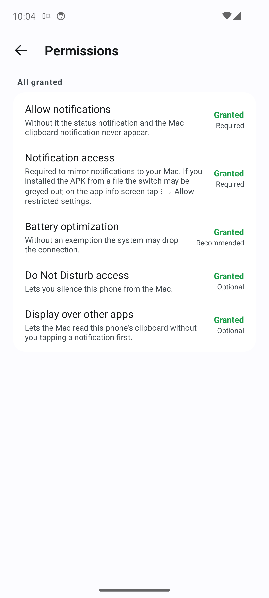
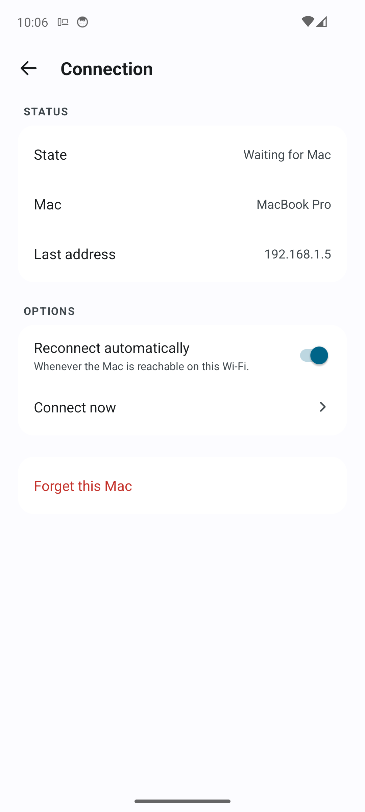
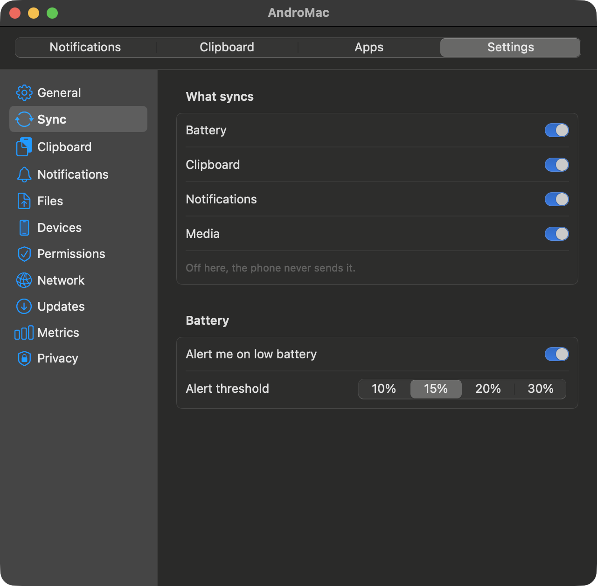
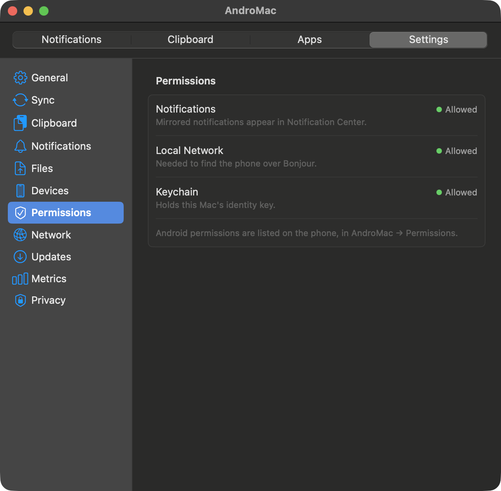

# AndroMac

AndroMac, bir Android telefonla bir Mac'i yalnızca kendi Wi-Fi ağın üzerinden eşitler. Pil
seviyesi, iki yönde pano, Mac'ten yanıtlayıp kapatabildiğin bildirim aynası, uygulama başına
bildirim kademesi, telefonda çalan parça ve kontrolleri, zil modu ve ses düzeyi, bir de kaybolan
telefonu çaldıran düğme. Sunucu, hesap ya da bulut yok; iki tarafta da üçüncü parti kütüphane yok.
İki uygulama birbirini Bonjour ile bulur, bir anahtar üzerinde anlaşır ve doğrudan konuşur.

[](https://github.com/anilmetin0/AndroMac/actions/workflows/build.yml)
[](https://github.com/anilmetin0/AndroMac/releases/latest)
[](LICENSE)
[](#kurulum)

🇬🇧 English: [README.md](README.md)

<table>
<tr>
<td width="45%" align="center">

</td>
<td width="30%" align="center">

</td>
</tr>
</table>

## Özellikler

| Özellik | Yön | Ne yapar |
|---|---|---|
| Pil | Telefondan Mac'e | Seviye, şarj durumu ve sıcaklık. Menü çubuğunda isteğe bağlı yüzde, panelde çubuk, seviye seçtiğin eşiğin altına düşünce tek bir uyarı. Eşik Ayarlar → Eşitleme'de %10, %15, %20 ya da %30 olarak seçilir. |
| Pano | Mac'ten telefona | Kopyaladıkça otomatik ya da yalnızca paneldeki düğmeye basınca; seçim Ayarlar → Pano'da. Elle gönderim telefona "Yapıştır" eylemli sessiz bir bildirim olarak düşer; arka planda panoya yazmayı engelleyen üreticiler için. Parola yöneticisinin gizli işaretlediği pano hiç gönderilmez. |
| Pano | Telefondan Mac'e | Paneli açtığında Mac sorar, telefon yanıtlar. Telefonda AndroMac öne gelince pano kendiliğinden gider. Elle göndermek için Hızlı Ayarlar karesi, kalıcı bildirimdeki düğme ve paylaşım menüsü var. [Bu yön neden istenerek çalışıyor](#pano-neden-tek-yönde-istenerek-çalışıyor). |
| Pano geçmişi | Mac | İki yöndeki son 50 kayıt. Arama, tıklayınca panoya alma, sağ tıkla telefona geri gönderme ya da silme. |
| Bildirimler | Telefondan Mac'e | Uygulamanın kendi ikonuyla Bildirim Merkezi'ne düşer. Yanıt dahil eylemler Mac'ten tetiklenir; hangi cihazda kapatırsan diğerinde de kapanır. |
| Uygulama başına kademe | İki yön | Tam, Sadece başlık ya da Kapalı; iki cihazdan da ayarlanır. Kademe telefonda uygulanır: Kapalı'da o uygulama için radyo hiç uyanmaz, Sadece başlık'ta içerik telefondan çıkmaz. |
| Gürültü elemesi | Telefon | Grup başlıkları, kalıcı ve ön plan servisi bildirimleri, yalnızca cihaza özel bildirimler ve sessiz kanallar gönderilmeden elenir. Aynalama, yalnızca telefon kilitliyken çalışacak biçimde sınırlanabilir. |
| Bildirim geçmişi | Mac | Aranabilir son 200 kayıt, yalnızca Mac'te. |
| Medya | İki yön | Telefonda çalan parçanın başlığı, sanatçısı ve uygulaması; Mac'ten önceki, oynat/duraklat ve sonraki. Yalnızca değişimde gönderilir, ilerleme çubuğu yoktur. |
| Telefonu bul | Mac'ten telefona | Telefon en fazla 30 saniye alarm sesiyle çalar ve titrer. "Buldum", ikinci bir istek ya da süre dolması durdurur. |
| Telefon denetimleri | Mac'ten telefona | Panelden zil modu (zil, titreşim, sessiz) ve medya ses düzeyi; bir de bütün aynalama zincirini dolaşıp geri dönen test bildirimi. Sessize almak telefonda Rahatsız Etmeyin erişimi ister; izin yoksa düğme kapalı görünür. |
| Dosyalar | İki yön | Telefonda paylaşım menüsünden, Mac'te panelin **Dosya gönder…** düğmesinden ya da sürükleyip bırakarak. Alıcıya önce sorulur; otomatik kabul açılabilir ve açıkken eşleşmiş bütün telefonlar için geçerlidir. Dosyalar İndirilenler'e iner, SHA-256 ile doğrulanır ve kendiliğinden açılmaz. Bkz. [diğer araçlarla karşılaştırma](#diğer-araçlarla-karşılaştırma). |
| Birden fazla telefon | Mac | Aynı anda birden fazla Android eşleştirilip bağlanabilir. Panel cihaz kartının üstünde her telefon için bir sekme gösterir; sekmeye tıklamak ayrıntıların, denetimlerin ve pilin hangi telefona ait olduğunu değiştirir. Her cihazın bağlantısı tek tek kesilip yeniden kurulabilir; "Bağlantıyı kes" hem hattı kapatır hem sonraki denemeyi geri çevirir. Her telefonun kendi pano anahtarı vardır. Eşleştirme kaldırma Ayarlar → Cihazlar'da. |
| Doğrulama kodları | Mac | Aynalanan bildirimde tek kullanımlık kod varsa panel kodu bir kopyalama düğmesinin üstünde gösterir. Kopyalamak kodu telefona geri göndermez ve pano geçmişine yazmaz. |
| Bağlantı rehberi | İki taraf | İki uygulama da hangi adımın takıldığını gösterir; telefonda ayrıca canlı bir tanı ekranı var. |
| Ölçümler | Mac | Saatlik mesaj, trafik, yeniden bağlanma sayısı ve en sık mesaj tipleri. Enerji iddiası böylece ölçülebilir. |
| Güncellemeler | İki taraf | İki uygulama da günde bir kez denetler, bulduğunu açılışta bir kez önerir ve kendisi kurar. İndirilen dosya, hiçbir şey değiştirilmeden önce sürümle yayınlanan sağlama toplamına göre doğrulanır. Tek anahtar denetimi kapatır. |

Kapsam dışı: SMS, arama kontrolü, birden fazla Mac, internet üzerinden erişim. İstediğin kadar
telefon, tek Mac, tek yerel ağ.

### Pano neden tek yönde istenerek çalışıyor

Android 10'dan beri bir uygulama ön planda değilse panoyu okuyamıyor. Bu kasıtlı bir gizlilik
kararı ve desteklenen bir baypası yok. Bu yüzden telefon her kopyayı kendiliğinden göndermez.
Mac panelini açmak telefondan panosunu ister; telefon da bir anlığına odağı alan görünmez bir
etkinlikle panoyu okuyup yanıtlar. AndroMac'i telefonda öne getirdiğinde de pano gider, çünkü o
anda uygulama zaten ön plandadır.

O görünmez etkinlik telefonda tek bir izin ister: **Diğer uygulamaların üzerinde göster**. Bu,
sıradan bir uygulamanın Android'in arka planda etkinlik başlatma kuralından tek muafiyeti.
Uygulama SYSTEM_ALERT_WINDOW iznini bildirdiği için Android'in listesinde görünür ve anahtar
açılabilir. İzin yoksa telefon tek düğmeli bir bildirim gösterir; kare ve paylaşım menüsü de
çalışmaya devam eder. Paylaşım menüsü yolu panoya hiç dokunmaz, en temizi odur. İzni vermeyen ve
o bildirime de dokunmayan bir telefon hiçbir şey göndermez; protokolde onun panosunu okuyabilecek
başka bir yol da yok.

## Nasıl çalışır

Sunucu Mac tarafı. `_andromac._tcp` servisini, sistemin verdiği bir portta Bonjour ile duyurur.
Telefon istemcidir; önce en son çalışan adresi dener, o tutmazsa servisi aramaya başlar.

```mermaid
sequenceDiagram
    participant P as Android telefon
    participant M as Mac

    Note over M: _andromac._tcp servisini Bonjour ile duyurur
    P->>M: TCP bağlantısı, önce son bilinen adres
    P->>M: protokol sürümü, geçici anahtar A
    M->>P: protokol sürümü, geçici anahtar B, şifreli(kalıcı anahtar B, nonce B taahhüdü)
    Note over P: ECDH(eA, eB) ile açar, kalıcı anahtar B'yi sabitlenenle karşılaştırır<br/>Uyuşmazsa burada kapatır; telefonun anahtarı telefondan çıkmaz
    P->>M: şifreli(kalıcı anahtar A), yalnızca Mac'in kalıcı gizli anahtarıyla okunur
    Note over P,M: dh1 = ECDH(eA, eB) ileri gizlilik<br/>dh2 = ECDH(sA, eB) telefonu doğrular<br/>dh3 = ECDH(eA, sB) Mac'i doğrular<br/>HKDF-SHA256 her yön için bir anahtar türetir
    P->>M: AES-256-GCM(transcript ‖ nonce A), nonce 0
    M->>P: AES-256-GCM(transcript ‖ nonce B), nonce 0
    Note over P,M: Uyuşmazlık ya da taahhüdüne uymayan nonce B bağlantıyı burada kapatır
    Note over P,M: İki ekranda da aynı 6 hane çıkar; transcript ‖ nonce A ‖ nonce B'den türetilir
    P-->>M: Kullanıcı telefonda onaylar
    M-->>P: Kullanıcı Mac'te onaylar
    Note over P,M: Her taraf diğerinin kalıcı anahtarını sabitler
    P->>M: hello, pil, bildirim, medya, pano
    M->>P: 240 sn'de bir ping, pano, eylemler, kontroller
```

### Güven modeli

El sıkışma, NIST P-256 üzerinde bir Noise-KK deseni. Her cihazın uzun ömürlü bir anahtar çifti
var; her oturumda ayrıca yeni bir geçici çift üretiliyor. Bugün kaydedilen bir oturum, yarın
cihazlardan biri ele geçse bile çözülemez. Açıkta yalnızca geçici anahtarlar gider. Mac'in uzun
ömürlü anahtarı geçici sırla şifrelenmiş olarak gelir. Telefon kendi anahtarını ancak Mac'inkini
sabitlenenle karşılaştırdıktan sonra gönderir ve onu yalnızca gerçek Mac'in okuyabileceği biçimde
şifreler. Ağı dinleyen biri iki rastgele oturum anahtarı görür; porta cevap veren bir yabancı
telefon hakkında hiçbir şey öğrenmez. Üç Diffie-Hellman sonucu, bir transcript özetiyle birlikte
HKDF-SHA256'dan geçirilip her yön için birer AES-256-GCM anahtarına dönüşür. Ardından iki taraf
da transcript'i şifreleyip diğerinin gönderdiğini kontrol eder. Uyuşmazsa bağlantı, hiçbir
uygulama mesajı okunmadan kapanır.

Buraya kadarı araya kimsenin girmediğini gösterir ama hangi cihazların konuştuğunu kanıtlamaz.
6 haneli kod bunun için var. Kod, el sıkışmanın tüm transcript'inden ve iki tarafın birer
rastgele nonce'undan türetilir. Mac, telefon kendi nonce'unu açıklamadan önce kendi nonce'una bir
özetle taahhüt verir. Araya giren bir cihaz, her kodun kendi yarısını diğer yarıyı görmeden
sabitlemek zorunda kalır. Deneme başına şansı milyonda birdir ve her başarısız deneme ekranlarda
görünür bir uyuşmazlık bırakır. Yalnızca kalıcı anahtarlardan türetilen bir kodda bu özellik
olmazdı; saldırgan iki ekran aynı sayıyı gösterene kadar çevrimdışı anahtar çifti üretebilirdi.
KDE Connect'in 2025'te düzelttiği zafiyet bu sınıftandı. Haneleri karşılaştır, iki cihazda da
onayla; her taraf diğerinin kalıcı açık anahtarını kalıcı olarak sabitler.

Bundan sonrası sabitlenen anahtarın işi. Telefon tek bir Mac'i sabitler ve orada kural mutlaktır.
Mac bir telefon kümesi sabitler; orada tanımadığı bir anahtar bilinmeyen bir cihaz sayılır ve
sıradan bir ilk temas isteği çıkarır. Bayt bayt uyuşmayan bir anahtar reddedilir ve "anahtar
değişti" diye bildirilir. Kabul edilmez, yeniden sabitlenmez; tekrar Eşleştir'e dokunmak da bunu
temizlemez. Uygulamalardan birini yeniden kurmadığın hâlde bu uyarıyı görüyorsan bir sorun var
demektir, reddet. Mac'te bir kodu reddetmek o anahtarı giderek uzayan bir süre susturur; süre bir
dakikadan başlar ve bir saate kadar ikiye katlanır. Yabancı biri eşleştirme penceresini dırdıra
çeviremez. Bonjour kaydında anahtar yok ve kaydın bu kararda payı yok; yalnızca el sıkışma
sırasında kanıtlanan anahtar sayılır. Adlar için de aynısı geçerli. Bonjour kaydındaki ad yalnızca
Mac'i bulmaya yarar; bağlandıktan sonra gösterilen ad şifreli oturumun içinden gelir.

Kablo üzerindeki biçimin tamamı [docs/PROTOCOL.md](docs/PROTOCOL.md) dosyasında.

### Diğer araçlarla karşılaştırma

Dosya transferi eklenmeden önce Syncthing, LocalSend, KDE Connect, Quick Share, AirDrop, Magic
Wormhole ve Blip'in güven modelleri ile transfer protokolleri yan yana okundu. Belgelenmiş bir
zayıflığı ya da yayımlanmış bir güvenlik duyurusu olan her tasarımda AndroMac farklı davranır.

| Soru | Diğerlerinde | AndroMac'te |
|---|---|---|
| Uygulamayla kim konuşabilir? | LocalSend, isteğe bağlı bir PIN'in ardında yerel ağdaki her cihazdan transfer kabul eder; parmak izi hatırlanır ama doğrulanmaz ([issue #162](https://github.com/localsend/localsend/issues/162)). KDE Connect ve Syncthing doğrulanmamış keşif paketlerini kabul edip güvene sonra karar verir. | El sıkışmayı yalnızca sabitlenmiş anahtar tamamlayabilir. Transfer başına PIN yok; eşleştirme zaten PIN'dir. Keşif yalnızca bir ipucudur, kanıtı el sıkışma verir. |
| Eşleştirmede gösterilen kod sahte olabilir mi? | KDE Connect'in 8 onaltılık karakterlik kodu iki sertifikanın özetiydi ve kaba kuvvetle bulunabiliyordu ([duyuru, Nisan 2025](https://kde.org/info/security/advisory-20250418-3.txt)); düzeltme özete zaman damgası karıştırıyor. | Kod, taze bir transcript'e ve taahhütle değiş tokuş edilen nonce'lara bağlı. Çevrimdışı üretilemez ve her deneme görünür bir uyuşmazlığa mal olur. |
| Gösterilen cihaz adına güvenilir mi? | KDE Connect, eşleşmiş cihazlar için bile adı düz metin keşif paketinden gösteriyordu; sahtesi yapılabiliyordu. AirDrop, telefon numaranın ve e-postanın özetlerini yakındaki herkese yayınlar; bunlar milisaniyeler içinde geri çözülür ([PrivateDrop, USENIX 2021](https://privatedrop.github.io/)). | Bağlandıktan sonra gösterilen ad şifreli `hello` mesajından gelir. Bonjour kaydında yalnızca bir ad ve protokol sürümü var; anahtar yok, hesaba ya da kişiye bağlı hiçbir şey yok. |
| Kabul'e basmadan önce ne olur? | Quick Share, kabul yanıtından önce yük çerçevelerini işliyordu; bu, uzaktan kod çalıştırmaya kadar zincirlendi ([CVE-2024-38272](https://www.safebreach.com/blog/rce-attack-chain-on-quick-share/)). LocalSend'in Hızlı Kaydet'i herkesten kabul eder. | `file_accept`'ten önce diske hiçbir şey yazılmaz; kabul edilmemiş bir kimliğe ait parça bellek ayrılmadan atılır. Otomatik kabul var ama yalnızca sabitlenmiş cihaz için. |
| Dosya doğrulanır mı? | KDE Connect yalnızca TLS'ye güvenir, uygulama katmanında özet yok. Syncthing her bloğu özetler. LocalSend'de özet isteğe bağlı. | Her parça 512 KiB ile sınırlı. Dosyanın tamamı, son adını almadan önce SHA-256 ile doğrulanır; o ana kadar bir `.part` dosyası ya da bekleyen bir medya kaydıdır. |
| Dosya adı ne olacak? | Quick Share zincirinde alıcı tarafında bir yol geçişi (path traversal) vardı. AirDrop, bilinmeyen türlerde uzantının arkasına " 2" ekler. | Alıcı yalnızca son yol bileşenini tutar, denetim karakterlerini ve baştaki noktaları atar, uzunluğu sınırlar ve kopyaları uzantıdan önce numaralar. |
| Gelen dosya açılır mı? | KDE Connect'in `open` bayrağı dosyayı gelir gelmez başlatır. | Hiçbir zaman. macOS, tarayıcı indirmesine konan karantina bayrağının aynısını koyar. Android dosyayı MediaStore üzerinden İndirilenler'e yazar; uygulamanın depolama iznine ihtiyacı yoktur. |
| Bir yabancı uygulamayı tüketebilir mi? | KDE Connect doğrulanmamış bağlantılarla açık tutulabiliyordu ([CVE-2020-26164](https://nvd.nist.gov/vuln/detail/CVE-2020-26164)). | En fazla dört bekleyen el sıkışma, her biri 10 saniye. 30 saniyede bir eşleştirme sorusu, yön başına tek transfer ve 8 parçalık (4 MiB) sınırlı pencere; karşı taraf telefonun belleğini şişiremez. |
| Yerel ağdan bir şey çıkar mı? | Blip ve Magic Wormhole doğrudan yol bulunamayınca internet üzerinden aktarır; Syncthing'de küresel keşif ve aktarıcılar var. | Hiçbir zaman. Geri düşülecek bir aktarıcı yok. |

Olduğu gibi alınanlar da var. LocalSend'in transfer başına kimlikli teklif-sonra-kabul akışı,
Syncthing'in parçala-ve-özetle disiplini ile geçici dosya sonra yeniden adlandırma yaklaşımı,
Quick Share'in iki ekranda onaylanan kısa sayı fikri ve bir şey olmadan önce göndereni ve boyutu
söyleyen kabul penceresi. Magic Wormhole'un parolayla doğrulanmış anahtar değişimi iki yabancı
için uygun ama burada gereksiz. Sabitlenmiş uzun ömürlü anahtarlarla karşılıklı doğrulama zaten
çözülmüş durumda; transfer başına bir kod yalnızca fazladan dokunuş eklerdi.

Ağın hâlâ gördüğü şunlar: Bonjour kaydındaki Mac adı ve ona bir telefonun bağlandığı. İki uzun
ömürlü anahtar da el sıkışmada şifreli gittiği için pasif bir dinleyici hangi telefon olduğunu
anlayamaz. Aktif biri yalnızca Mac'in anahtarını öğrenir; keşfedilebilir taraf olmanın bedeli bu.
O da rastgele bir anahtardır, içinde ad ya da hesap yoktur.

## Kurulum

Hazır paketler [yayın sayfasında](https://github.com/anilmetin0/AndroMac/releases/latest):
Mac için `AndroMac-<sürüm>-macOS-arm64.dmg`, telefon için `AndroMac-<sürüm>-android.apk`;
sağlama toplamları yanlarındaki `SHA256SUMS.txt` dosyasında. Mac paketi yalnızca Apple Silicon
(M1 ve sonrası) içindir, Intel derlemesi yok. APK tek dosyadır ve her telefonda çalışır: uygulamada
yerel kod olmadığından arm64 ya da başka bir ABI seçmek gerekmez.

### macOS 14 Sonoma ve üstü

1. DMG'yi aç, `AndroMac.app`'i **Uygulamalar**'a sürükle.
2. Uygulama ad-hoc imzalı, notarize değil; bu yüzden macOS ilk açılışı engeller. Bir kez açmayı
   dene, reddedilsin, sonra **Sistem Ayarları → Gizlilik ve Güvenlik**'e gidip **Yine de Aç**'a
   bas. Terminalden yapmak istersen:

   ```bash
   xattr -dr com.apple.quarantine /Applications/AndroMac.app
   ```
3. İlk açılışta Keychain sorusuna **Always Allow** de; kimlik anahtarı orada duruyor. Yerel Ağ
   sorusuna da **İzin ver** de, yoksa telefon bulunamaz.
4. AndroMac'in Dock ikonu yok. Menü çubuğunda yaşar; paneli açmak için telefon silüetine tıkla.
5. İsteğe bağlı: Ayarlar → Genel → **Oturum açınca başlat**.

[Homebrew](https://brew.sh) ile aynı iş iki komut. Tap bu deponun içinde, o yüzden URL ile
eklenir:

```bash
brew tap anilmetin0/andromac https://github.com/anilmetin0/AndroMac
brew install --cask andromac                    # güncel paket
brew install --cask --no-quarantine andromac    # aynısı, Yine de Aç adımı olmadan
```

Cask'in sabit bir sürümü yok; güncel paketi yayın API'sinden bulur. Bu yüzden düz `brew upgrade`
yerine `brew upgrade --cask --greedy-latest andromac` ile güncellenir.

### Android 10 ve üstü

1. APK'yı telefona kopyala ve bir dosya yöneticisinden dokun. Android, o uygulamadan kuruluma
   izin vermeni isteyecek.
2. AndroMac'i aç. Bildirim iznini hemen ister; bildirim erişimi ekranını da gerekçesiyle birlikte
   bir kez önerir. Ana ekrandaki **İzinler** kartı durumu tek satırda özetler: ya "Tüm izinler
   verildi" yazar ya da eksik olanları söyler ve altında listeler. Eksik bir izne dokununca
   ilgili sistem ekranı açılır. Kartın başlığına dokununca beş iznin tamamını "Verildi" ya da
   "Verilmedi" durumuyla ve Zorunlu, Önerilir ya da İsteğe bağlı notuyla listeleyen İzinler
   ekranı açılır. İlk ikisi zorunlu, pil optimizasyonu önerilir, son ikisi isteğe bağlı:
   - **Bildirimlere izin ver**, uygulamanın kendi kalıcı ve pano bildirimlerini gösterebilmesi
     için.
   - **Bildirim erişimi**, bildirim aynası ve medya oturumunu okumak için.
   - **Pil optimizasyonu**, ekran kapalıyken sistem bağlantıyı kesmesin diye.
   - **Rahatsız Etmeyin erişimi**, Mac'in telefonu sessize alabilmesi için.
   - **Diğer uygulamaların üzerinde göster**, Mac panoyu isteyince sen bildirime dokunmadan yanıt
     gelsin diye. Uygulama SYSTEM_ALERT_WINDOW iznini bildirdiği için Android'in listesinde
     görünür ve anahtar açılabilir.
3. İki zorunlu izinden biri eksikken ekranın üstünde hangisinin eksik olduğunu söyleyen bir şerit
   durur; dokununca doğru ayar ekranını açar, çarpı ise başka bir izin geri alınana kadar kapatır.
   Şerit yalnızca bu iki izin için var, çünkü onlarsız ayna hiçbir şey aktarmaz.
4. Android 13 ve üstünde, dışarıdan kurulan uygulamalarda bildirim erişimi anahtarı gri görünür
   ve kısıtlı ayarlardan söz eden bir mesaj çıkar. Sistem denemeyi kaydetsin diye bir kez dene,
   sonra **Ayarlar → Uygulamalar → AndroMac → ⋮ → Kısıtlı ayarlara izin ver** yolunu izleyip
   tekrar dene.
5. Kart her zaman görünür. Hepsi verilince "Tüm izinler verildi" yazar; eksik olan varsa, isteğe
   bağlı olsa bile listede durur.

[Obtainium](https://github.com/ImranR98/Obtainium) APK'yı doğrudan yayın sayfasından kurar ve
günceller. Uygulama olarak `https://github.com/anilmetin0/AndroMac` adresini ekle ya da telefonda
şu bağlantıyı aç: [obtainium://add/github.com/anilmetin0/AndroMac](obtainium://add/https://github.com/anilmetin0/AndroMac).
Yayın APK'sı her sürümde aynı anahtarla imzalanır, güncellemeler yerinde kurulur. Obtainium etiket
adına bakar ve etiket bir sürüm geliştirmedeyken değişmez; bu yüzden aynı sürümün yeni paketini
ancak **yayın tarihini sürüm olarak kullan** seçeneği açıkken fark eder. Aşağıda anlatılan
uygulama içi denetim ise commit'i karşılaştırdığı için fark eder.

### Güncelleme denetimi

İki uygulama da günde bir kez denetler ve bulduğunu kendisi kurabilir. İki tarafta da **Ayarlar →
Güncellemeler**'de bir anahtar ve **Şimdi denetle** düğmesi var. Denetim yalnızca açılışta ve menü
çubuğu paneli açıldığında çalışır; zamanlayıcı yok. Daha yeni bir paket varsa uygulama bunu bir
kez `1.0.0 (fd7d47a)` biçiminde önerir: **Şimdi kur**, **Sonra**, **Bu sürümü atla**. Daha yeni
paket, daha büyük bir sürüm ya da aynı sürümün başka bir commit'ten derlenmiş hali olabilir.

Kurulumu oradan sonra uygulama üstlenir. Yayın dosyasını indirir, o yayınla birlikte yayınlanan
`SHA256SUMS.txt` ile doğrular ve ancak ondan sonra kendini değiştirir. Mac paketini takas edip
yeniden başlar; telefon APK'yı Android'in kurucusuna verir, kurucu sana sorar ve imzayı denetler.
Eksik ya da uyuşmayan bir sağlama toplamı güncellemeyi durdurur.

Uygulamaların bir sunucuyla konuşmasına yol açan tek şey bu denetimdir: api.github.com'a giden,
yalnızca uygulama sürümünü taşıyan tek bir istek. Varsayılan olarak açık, çünkü hiçbir mağazada
olmayan bir uygulamanın sana düzeltme çıktığını söyleyebileceği başka bir yol yok. Anahtarı
kapatırsan ağından hiçbir şey çıkmaz. Bkz. [Gizlilik ve güvenlik](#gizlilik-ve-güvenlik).

## Eşleştirme

1. Mac'te AndroMac'i aç ve iki cihazın da aynı Wi-Fi ağında olduğundan emin ol.
2. Telefonda **Eşleştir**'e dokun.
3. İki ekranda da aynı 6 hane çıkmalı. Aynıysa ikisinde de onayla. Değilse reddet; el sıkışmaya
   biri girmiş demektir.

Sonrası otomatik. Ağ geri geldiğinde telefon kendi başına yeniden bağlanır.

Eşleştirilmemişken iki uygulama da her adımın canlı durumunu gösteren bir rehber sunar; hangi
adımın takıldığını oradan görürsün:

| Adım | Telefonda | Mac'te |
|---|---|---|
| Mac'te uygulama açık mı | `Mac ağda görüldü` ya da `bulunamadı` | `Bu Mac ağda yayında` |
| Aynı ağ | `Telefon: 192.168.1.42` | `Bu Mac: 192.168.1.5` |
| Eşleştirme | `Hazır` ya da `Önceki adımları tamamla` | Telefon bekleniyor |

Yine de bağlanmıyorsa rehberin altındaki **Bağlanamıyorum** canlı tanıyı açar: telefonun adresi
ve alt ağı, Mac görüldü mü, eşleştirme ve bağlantı durumu, uygulama sürümü, ardından belirtiye
göre çözüm listesi. Mac'te Ayarlar → Ağ aynı bilgiyi verir ve Yerel Ağ iznine doğrudan bağlantı
sunar.

Mac'in eşleştirme penceresi de telefonunki de haneleri büyük gruplar hâlinde gösterir. Daha önce
sabitlenmiş anahtar değişmişse telefonda varsayılan düğme **Reddet** olur. Mac'te ilk telefonda
varsayılan **Eşleştir**, sonraki her istekte **Reddet**; beklenmedik bir telefon şüphelidir.

## Ekran görüntüleri

<table>
<tr>
<td align="center"></td>
<td align="center"></td>
<td align="center"></td>
<td align="center"></td>
</tr>
<tr>
<td colspan="2" align="center"></td>
<td colspan="2" align="center"></td>
</tr>
<tr>
<td colspan="4" align="center"></td>
</tr>
<tr>
<td colspan="4" align="center"></td>
</tr>
<tr>
<td colspan="4" align="center"></td>
</tr>
<tr>
<td colspan="4" align="center"></td>
</tr>
</table>

## Ayarlar

Telefonun ana ekranı sade kalır: bağlantı durumu, **Pil durumu**, **Pano**, **Bildirimler** ve
**Medya** için dört senkronizasyon anahtarı, **İzinler** kartı, iki ayrıntı satırı ve en altta
sürüm. İki uygulama da sürümü aynı biçimde yazar: `1.0.0 (12 · abc1234)`, yani sürüm, derleme
numarası ve derlendiği commit. Hata bildirirken bu satırın tamamını yaz. Gerisi bir alt seviyede.

| Ekran | İçinde ne var |
|---|---|
| İzinler | Beş iznin tamamı, "Verildi" ya da "Verilmedi" durumu ve Zorunlu, Önerilir ya da İsteğe bağlı notuyla. Ana ekrandaki İzinler kartının başlığından açılır. |
| Bağlantı | Durum, Mac'in adı ve son adresi, **Otomatik yeniden bağlan**, **Şimdi bağlan** ve **Bu Mac'i unut**. |
| Bildirim ayarları | Neyin ayarlı olduğunu özetleyen **Uygulama filtresi**, **Sessiz bildirimler** ve **Sadece telefon kilitliyken**. Her zaman elenenleri de listeler. |
| Uygulama filtresi | Telefonun gördüğü her uygulama için üç kademeli seçici; Bildirim ayarları'ndan açılır. |
| Pano ayarları | Gelen: **Panoya otomatik yaz**, **Bildirim göster**. Giden: **Hassas içeriği gönderme**. Bir de **Panoyu Mac'e gönder**. |
| Bağlantı yardımı | Canlı tanı, sık karşılaşılan sorunlar ve işin nasıl yürüdüğü. Eşleştirme rehberindeki **Bağlanamıyorum**'dan açılır. |
| Güncellemeler | Günlük güncelleme denetimi: anahtar, **Şimdi denetle** ve yeni paketi indirip doğrulayarak kuran **Kur** düğmesi. |
| Dosyalar | **Dosya al** ve **Dosyaları otomatik kabul et**. Gelen dosyalar İndirilenler'e iner; gönderme herhangi bir uygulamanın paylaşım menüsünden yapılır. |
| Dil | Android'in uygulama başına dil seçicisini açar; İngilizce ve Türkçe sunar. |

Mac'te menü çubuğu paneli göz atmak içindir. En üstte cihaz kartı durur. Birden fazla telefon
eşliyse kart onları Finder sekmeleri gibi üstte sekmeler hâlinde gösterir; bir sekmeye tıklamak
hangi telefonun ayrıntılarının, denetimlerinin ve pilinin gösterildiğini değiştirir. Tek telefonda
sekme yoktur. Kart, seçili telefonun çalan parçasını, ses düzeyi sürgüsünü ve zil modu
düğmelerini, pano anahtarını, çaldırma düğmesini, test bildirimi düğmesini ve "Bağlantıyı kes"i
taşır. Altında pil, sonra son pano kaydı, iki yönden birinde dosya giderken bir ilerleme satırı ve
en son dört bildirim gelir. Durum satırı yalnızca hiç eşleştirme yokken ya da dinleyici kapalıyken
en üstte çıkar. AndroMac için macOS bildirimleri kapalıysa panel tek satırlık bir uyarı ve ilgili
Sistem Ayarları bölmesini açan bir düğme gösterir. Panelin üstüne bırakılan dosyalar gönderilir.
Menü çubuğu simgesine sağ tıklamak AndroMac'i aç, Ayarlar ve Çık menüsünü açar.
Neyin eşitleneceği bir kez Ayarlar'da kararlaştırılır; ayrıntı pencerede.

| Sekme | İçinde ne var |
|---|---|
| Bildirimler | Geçmiş; arama ve temizleme düğmesi. |
| Pano | Geçmiş; arama, tıklayınca panoya alma, sağ tıkla geri gönderme ya da silme. |
| Uygulamalar | Telefondaki her uygulama için kademe seçici. |
| Ayarlar | Kenar çubuğu düzeni: solda bölüm listesi, sağda seçili bölümün seçenekleri. Bölümler sırasıyla Genel, Eşitleme, Pano, Bildirimler, Dosyalar, Cihazlar, İzinler, Ağ, Güncellemeler, Ölçümler ve Gizlilik. |

Ayarlar → Genel'de **Oturum açınca başlat**, **Menü çubuğunda pil yüzdesi** ve Sistem, İngilizce,
Türkçe seçenekli bir **Dil** seçici var. Dil açılışta okunduğu için değiştirince bir "Yeniden
başlat" düğmesi çıkar. Eşitleme bölümü **Pil**, **Pano**, **Bildirimler** ve **Medya**
anahtarlarını tutar; düşük pil uyarısı anahtarı ve %10, %15, %20 ya da %30 seçenekli eşik seçici
de oradadır. Pano bölümünde **Mac'ten telefona** için otomatik/elle seçimi, gizli pano kuralı ve
panel açılınca telefondan panosunun istenip istenmeyeceği var. Bildirimler bölümünde yansıtılan
bildirimler için ses çalma anahtarı ve geçmişteki kayıt sayısı var. Dosyalar'da **Dosya al** ve
eşleşmiş bütün telefonlar için geçerli **Dosyaları otomatik kabul et** var. Cihazlar bölümü
eşleşmiş bütün telefonları durumlarıyla listeler ve her biri için **Unut** düğmesi verir; birden
fazla telefon varsa **Bütün cihazları unut** da vardır. Bu Mac'in adı ve uygulama sürümü de
oradadır. İzinler bölümü macOS Bildirimler, Yerel Ağ ve Anahtar Zinciri erişiminin durumunu
gösterir; verilmemiş olanın yanında ilgili Sistem Ayarları bölmesini açan bir düğme durur. Ağ,
iki adresi ve Yerel Ağ iznine bir kestirmeyi gösterir. Güncellemeler, [Güncelleme
denetimi](#güncelleme-denetimi) başlığındaki denetimi barındırır ve sürüm sayfasının QR kodunu
çizer; APK'yı telefona kurmak için adres yazman gerekmez. Ölçümler [Enerji](#enerji) başlığında
anlatılıyor. Gizlilik, neyin nerede saklandığını yazar.

## Gizlilik ve güvenlik

**Yerel ağdan hiçbir şey çıkmaz.** Ulaşılacak bir sunucu, açılacak bir hesap, telemetri ya da
analitik yok. Uygulamalar internete soket açmaz; tek istisna Ayarlar → Güncellemeler'deki,
varsayılan olarak açık güncelleme denetimi. O da `api.github.com`'a günde en fazla bir kez en yeni
sürümü sorar ve `User-Agent` başlığındaki uygulama sürümünden başka bir şey göndermez.
Güncellemeyi kurmak `github.com`'dan indirir, o da sen düğmeye bastıktan sonra. Anahtarı kapatınca
iki uygulama yine yalnızca birbiriyle konuşur.

Telefondan neyin çıkacağını, uygulama başına belirlediğin kademe tayin eder. Kapalı'da hiçbir şey
çıkmaz, radyo bile uyanmaz. Sadece başlık'ta yalnızca uygulama adı gider; başlık, gövde ve eylem
adları boş gönderilir, yani içerik telefondan hiç çıkmaz. Tam'da başlık, gövde ve eylem adları
gider. Bir parola yöneticisinin ya da OTP alanının `EXTRA_IS_SENSITIVE` ile işaretlediği pano
içeriği gönderilmez; bu kural varsayılan olarak açıktır. Bonjour kaydı yalnızca cihaz adını ve
protokol sürümünü taşır; anahtar taşımaz.

Ne nerede duruyor:

| Ne | Nerede |
|---|---|
| Mac'in kimlik anahtarı | macOS Keychain |
| Telefonun kimlik anahtarı | Android Keystore'da duran ve dışarı çıkarılamayan bir AES-256-GCM anahtarıyla sarmalanmış. Anahtar değişimi sırasında belleğe açılır; P-256'yı yazılımda yapmanın tavanı bu |
| Sabitlenen karşı anahtar, cihaz adı ve ayarlar | Her cihazda yerel olarak |
| Bildirim ve pano geçmişi | Yalnızca Mac'te, Application Support altında. Eşleştirmeyi kaldırınca silinir |

Diske yazılan tek şey dosyalar. Bir transfer ancak alıcı kabul ettikten sonra ya da eşleşmiş
cihazlar için otomatik kabulü açtıysan başlar; ondan önce hiçbir şey yazılmaz. Dosya, son adını
almadan önce SHA-256 özetiyle doğrulanır, kendiliğinden açılmaz ve Mac'te tarayıcı indirmesiyle
aynı karantina bayrağını taşır. Ad gelişte temizlenir; gönderen dizin seçemez.

Kablo üzerinde P-256 anahtar anlaşması, HKDF-SHA256 ve nonce olarak yön başına sayaç kullanan
AES-256-GCM var; tekrarlanan bir çerçeve bağlantıyı kapatır. Çerçeveler 1 MiB ile sınırlı ve
alıcı her alan için kendi uzunluk sınırını uygular. Mac, bir bağlantıya el sıkışmayı bitirmesi
için 10 saniye tanır ve aynı anda yalnızca birkaç doğrulanmamış bağlantı tutar. Eşleştirme
sorusunu hız sınırına bağlar, özel adres aralıklarının dışındaki bağlantıları reddeder ve kurulu
bir oturumu ancak yeni bağlantının el sıkışması bittikten sonra bırakır. Wi-Fi'ndeki başka bir
cihaz soket açarak telefonunu düşüremez. Hiçbir kayıt satırı mesaj içeriği ya da anahtar taşımaz.

### Kendin doğrulaman

Kripto iki kez ve birbirinden bağımsız yazıldı: macOS'ta CryptoKit, Android'de JCE. İkisinin
uyuştuğunu iki betik kanıtlıyor; betikler her push'ta CI'da da çalışıyor:

```bash
./verify-crypto.sh       # aynı vektörler: anahtar kodlaması, HKDF, nonce düzeni, GCM etiketi, SAS
./verify-handshake.sh    # gerçek Swift ve Kotlin oturum kodu, loopback üzerinden
```

İlki iki gerçeklemeyi vektör vektör karşılaştırır. İkincisi Swift'teki gerçek `Session.accept` ile
Kotlin'deki gerçek `Session.connect`'i konuşturur ve şunlara bakar: çerçeve sırası, doğrulama
turu, sabitlenen anahtar kontrolü, 6 haneli kodun iki tarafta da tutması ve her yönde 12
çerçevenin sayaç sırasına göre gelmesi.

İkisi birden var çünkü birinin geçmesi diğerini garanti etmiyor. Geliştirme sırasında vektörler
tutarken el sıkışma başarısızdı; macOS'ta ikinci ve üçüncü Diffie-Hellman işlemlerinin sırası
ters yazılmıştı.

Güvenlik açığı bildirmek için herkese açık bir issue açma; [SECURITY.md](SECURITY.md)'de anlatılan
özel bildirim yolunu kullan.

## Enerji

Telefon pilini veri miktarından çok radyonun uyanma sıklığı tüketir. Bu yüzden telefonda hiç
periyodik zamanlayıcı yok. Mac prize takılı olduğu için canlılık kontrolünü Mac yapar: 240
saniyede bir ping atar, telefon yalnızca cevap verir. Pil raporları sistemin zaten yayınladığı bir
broadcast'e biner, dakikada en fazla bir kez. Bildirim ve medya olay tabanlı, kısa birleştirme
pencereleriyle. Eleme radyo uyanmadan önce telefonda yapılır ve bağlantı kurulur kurulmaz mDNS
taraması durur.

Kuralların tamamı ve `dumpsys batterystats` ile nasıl ölçüleceği [docs/ENERGY.md](docs/ENERGY.md)
dosyasında. Mac'te Ayarlar → Ölçümler, boştayken bağlı her telefon için saatte yaklaşık 30 mesaj
göstermeli. Belirgin biçimde fazlası, kurallardan birinin çiğnendiği anlamına gelir.

## Kaynaktan derleme

macOS 14 ve üstü, Swift 6.2 araç zinciri için Xcode 26.6 ve üstü, JDK 25, bir de platform 37 ve
build-tools 36.0.0 içeren Android SDK gerekiyor. Gradle 9.7.1 wrapper üzerinden geliyor. Xcode
projesi yok; macOS tarafı bir Swift paketi, `build.sh` onu uygulama paketine dönüştürür.

`JAVA_HOME` ayarlıysa o kullanılır. Değilse betikler `java_home`'un bildirdiği en yeni JDK 25'i
seçer, o da yoksa varsayılan JDK'ya düşer.

```bash
./verify-crypto.sh && ./verify-handshake.sh          # önce kanıt

macos/build.sh                                       # → macos/build/AndroMac.app
open macos/build/AndroMac.app

android/gradlew -p android :app:installDebug         # telefon adb ile bağlıyken

(cd macos && swift test)                             # birim testleri, macOS tarafı
android/gradlew -p android :vectors:test             # birim testleri, JVM tarafı
```

`build.sh` paketi ad-hoc imzalar; bu her derlemede farklı bir kimlik ürettiği için Keychain her
açılışta sorar. Kalıcı bir sertifikan varsa bir kez sorar:

```bash
CODESIGN_IDENTITY="Apple Development: sen@example.com" macos/build.sh
```

Keychain sorusunu reddedersen uygulama yerine yeni bir anahtar üretmez. Geçici bir anahtarla
çalışır ve bunu panelde söyler; eşleştirmeni bozmaz.

Canlı bağlantıyı izlemek için telefonda `adb logcat -s AndroMac`, Mac'te
`log stream --predicate 'senderImagePath CONTAINS "AndroMac"'`. İkisi de mesaj içeriği taşımaz.

## Yayınlar

Her push ve her pull request aynı hattı çalıştırır: iki doğrulama betiği, Swift ve JVM birim
testleri, yerelleştirme tamlık kontrolü, Homebrew cask'lerinin lint'i, macOS uygulama paketi ve
Android APK.

`main`'e giden push'lar ayrıca yayın da yapar. Ürün geliştirme aşamasında ve `VERSION`
dosyasındaki sürümde kalıyor; her push o sürüm için tek bir döner yayını yeniden yayımlar: etiket
`v1.0.0`, başlık `AndroMac 1.0.0`, dosya adlarında sürüm; commit etiketin hedefidir. Notlar
`CHANGELOG.md` dosyasındaki `## <sürüm>` bölümünden gelir, `CHANGELOG.tr.md` dosyasının aynı
bölümü altına katlanır, ardından önceki paketten bu yana gelen commit'ler listelenir. İkisinden
biri eksikse yayın başarısız olur.

Yeni bir sürüm, `VERSION`'ı yükselten ve iki changelog'a da eşleşen bölümü ekleyen tek bir
commit'le başlar. Bu, eski yayını dondurur; sonraki push yeni bir döner yayın açar. Adım adım
liste [docs/RELEASING.md](docs/RELEASING.md) dosyasında.

APK, depo gizlilerinden alınan bir yayın keystore'uyla imzalanır. Bu gizliler yoksa derleme debug
anahtarına düşer ve uyarı basar. Böyle bir APK kurulur ama sonraki bir yayınla yerinde
güncellenemez, çünkü runner'ın debug anahtarı her çalıştırmada yeniden üretilir.
`scripts/setup-android-signing.sh` bir keystore üretir, onu ve parolasını deponun dışında tutar
ve iş akışının beklediği dört gizliyi yükler. O keystore'u yedekle; kaybedersen güncelleme yolu
kapanır.

macOS uygulaması notarize edilmiyor, bunun için ücretli bir Developer ID gerekiyor. Yukarıdaki
kurulum adımları da bu yüzden var.

## Depo yapısı

```
VERSION                            güncel sürüm; her push onun yayınını yeniden yayımlar
CHANGELOG.md, CHANGELOG.tr.md      yayın notları, yayın işi bunları okur
verify-crypto.sh                   iki kripto gerçeklemesinin uyuştuğunu vektör vektör kanıtlar
verify-handshake.sh                gerçek Swift ve Kotlin oturum kodunu loopback'te konuşturur
scripts/setup-android-signing.sh   APK imzalama anahtarını üretir ve gizli olarak yükler
Casks/andromac.rb                  Homebrew cask, güncel paketi yayın API'sinden bulur
.github/workflows/build.yml        doğrula, test et, iki uygulamayı derle, yayını çıkar
.github/dependabot.yml             action'lar ve Gradle eklentileri için haftalık güncelleme

docs/PROTOCOL.md                   iki tarafın da göre yazıldığı kablo protokolü
docs/ENERGY.md                     enerji kuralları, hangisi nerede ve nasıl ölçülür
docs/RELEASING.md                  yayın listesi ve hattın onunla ne yaptığı

android/                           AGP 9.4.0, Gradle 9.7.1, minSdk 29, bağımlılık yok
  app/src/main/AndroidManifest.xml
  app/src/main/kotlin/dev/andromac/
    core/Crypto.kt                 düz JCE ile P-256, HKDF ve AES-GCM; Android API'si yok
    core/Session.kt                başlatan taraf olarak el sıkışma ve şifreli çerçeveleme
    core/Protocol.kt               mesaj kurucuları ve sabitler
    core/Store.kt                  kimlik anahtarı, sabitlenen anahtar, kademeler, ayarlar
    core/Version.kt                sürüm ayrıştırma ve sıralama, önce sürüm sonra commit
    core/FileNames.kt              dosya adı temizleme ve kopya numaralama, saf Kotlin
    core/Link.kt                   bağlantı durumu ve tek iş parçacıklı gönderim kuyruğu
    core/NetworkInfo.kt            rehber için telefonun adresi ve alt ağı
    net/LinkService.kt             ön plan servisi: bağlanma döngüsü, backoff, dağıtım
    net/Discovery.kt               mDNS, yalnızca bağlantı yokken
    net/BootReceiver.kt            açılışta servisi başlatır, yalnızca eşleşmişse
    feature/NotificationRelay.kt   ayna: yapısal eleme, kademe, birleştirme
    feature/AppModeSync.kt         kademe listesini Mac'e gönderir
    feature/BatteryReporter.kt     pil; %1 ya da şarj değişiminde, dakikada en fazla bir kez
    feature/ClipboardBridge.kt     iki yönde pano, hassas içerik kontrolüyle
    feature/ClipTile.kt            Hızlı Ayarlar karesi
    feature/MediaBridge.kt         etkin medya oturumu ve Mac'ten gelen kontroller
    feature/FindPhone.kt           alarm, titreşim ve "Buldum" bildirimi
    feature/IconProvider.kt        uygulama ikonları, paket başına bir kez
    feature/AppLabel.kt            paket adından görünen ada
    feature/UpdateCheck.kt         GitHub API'ye günlük sürüm denetimi
    feature/Updater.kt             APK'yı indirip doğrular, kurulumu sistem yapar
    feature/SystemBridge.kt        zil modu ve ses düzeyi; Mac'e bildirilir, Mac'ten ayarlanır
    feature/FileTransfer.kt        dosya gönderme ve alma: teklif, onay, parçalar, özet, MediaStore
    ui/MainActivity.kt             durum, eşleştirme, rehber, senkronizasyon anahtarları
    ui/HelpActivity.kt             canlı tanı ve sorun giderme
    ui/UpdateSettingsActivity.kt   güncelleme anahtarı ve Şimdi denetle
    ui/FileSettingsActivity.kt     dosya alma ve otomatik kabul
    ui/NotificationSettingsActivity.kt, ui/ClipboardSettingsActivity.kt, ui/AppsActivity.kt
    ui/ShareActivity.kt            paylaşım hedefi: metin panoya, dosyalar FileTransfer'a
    ui/ClipActivity.kt             pano okuma için görünmez yardımcı
    ui/SettingsRows.kt, ui/Insets.kt
  app/src/main/res/
    values/strings.xml             İngilizce, temel dil
    values-tr/strings.xml          Türkçe
    xml/locales_config.xml         uygulama başına dil seçicisinin sunduğu diller
  vectors/                         Crypto, Session ve Protocol'ü düz JVM'de çalıştırır
    src/test/                      Version, UpdateCheck ve FileNames için JVM birim testleri

macos/                             Swift paketi, swift-tools 6.2, macOS 14+, bağımlılık yok
  Package.swift
  build.sh                         .app'i derleyip paketler, sürümü yazar, imzalar
  scripts/update-strings.sh        yerelleştirme anahtarlarını çıkarır, .strings dosyalarını yazar
  Resources/Info.plist
  Resources/Localization/          en.lproj ve tr.lproj
  Resources/make-icon.swift        uygulama ikonunu üretir, depoda ikili dosya durmasın diye
  Sources/AndroMacKit/
    Crypto.swift                   aynı kripto, CryptoKit ile
    Session.swift                  yanıtlayan taraf olarak el sıkışma ve şifreli çerçeveleme
    Wire.swift                     NWConnection üzerinde uzunluk önekli çerçeveler
    Version.swift                  sürüm ayrıştırma ve sıralama, önce sürüm sonra commit
    FileNames.swift                dosya adı temizleme, kopya numaralama ve parça hesabı
    PairedDevice.swift             diske yazıldığı haliyle bir güvenilen telefon, anahtarıyla anahtarlanır
    VerificationCode.swift         bildirimdeki tek kullanımlık kodu bulur, kopyalama düğmesi için
    ReleaseInfo.swift              güncelleme denetiminin karşılaştırdığı yayın
  Sources/AndroMac/
    AndroMacApp.swift              menü çubuğu ögesi, pencere ve eşleştirme penceresi
    Server.swift                   Bonjour, el sıkışma sınırları, oturum, ping, dağıtım
    AppState.swift                 arayüzün okuduğu tek durum
    Store.swift                    Keychain kimliği, sabitlenen anahtar, ayarlar, girişte başlatma
    UpdateCheck.swift              GitHub API'ye günlük sürüm denetimi
    Updater.swift                  yayını indirir, doğrular, kurar ve yeniden başlar
    FileTransfer.swift             dosya gönderme ve alma: teklif, onay penceresi, parçalar, özet, karantina
    MenuPanel.swift                menü çubuğu paneli
    DeviceList.swift               eşleşmiş her telefon bir sekme; denetimleri ve "Bağlantıyı kes" ile
    Theme.swift                    yazı tipleri, boşluklar ve arayüzün oturduğu platform yüzeyleri
    DemoMode.swift                 ekran görüntüleri için uydurma veri, ANDROMAC_DEMO=1 olmadan kapalı
    PanelComponents.swift          rehber adımı, medya satırı, bildirim satırı
    MainWindow.swift               dört sekme
    PairingWindow.swift            6 haneli kod
    HistoryList.swift, ClipboardList.swift, AppsList.swift, SettingsList.swift, SharedViews.swift
    NotificationMirror.swift       Bildirim Merkezi: kategoriler, yanıt, sustur, pil uyarısı
    NotificationHistory.swift, ClipboardHistory.swift, IconCache.swift, AppModes.swift
    ClipboardWatcher.swift         pano taraması, yalnızca bağlıyken, yankı kırıcıyla
    LinkStats.swift                ölçümler
    NetworkInfo.swift              bu Mac'in adresi
  Sources/SelfTest/                betiklerin kullandığı vektör yazıcısı ve el sıkışma yanıtlayıcı
  Tests/AndroMacKitTests/          Swift Testing birim testleri
```

## Sorun giderme

| Belirti | Neye bakmalı |
|---|---|
| Telefon Mac'i bulamadığını söylüyor | Mac'te AndroMac açık mı; iki cihaz da aynı Wi-Fi'da mı, misafir ağı ya da AP izolasyonu olan bir ağ değil ya; Yerel Ağ izni verildi mi (Mac'te Ayarlar → Ağ'dan ulaşılıyor). |
| Bağlanıyor, sonra kopuyor | Telefonda pil optimizasyonu muafiyeti ve router'daki AP izolasyonu. |
| Bildirimler gelmiyor | Bildirim erişimi, Android 13+ kısıtlı ayarlar akışı dahil; uygulama Kapalı kademesinde olabilir; sessiz bildirimler varsayılan olarak gönderilmez. |
| Telefonda "Anahtar değişti" uyarısı | Mac uygulamasını yeniden kurduysan normaldir; telefonda eşleştirmeyi kaldırıp yeniden eşleştir. Kurmadıysan reddet. Yeniden kurulan bir telefon ise Mac'e yeni bir cihaz olarak gelir; eski kayıt sen silene kadar durur. |
| Keychain her açılışta soruyor | Ad-hoc imza her derlemede değişir. Yayın paketini kullan ya da `CODESIGN_IDENTITY` ile derle. |
| Pano telefondan kendiliğinden gelmiyor | Yukarıda anlatılan Android kısıtı. Mac paneli açılınca telefondan ister; telefonda AndroMac'i öne getirmek de gönderir. Anında yanıt için telefonda **Diğer uygulamaların üzerinde göster** iznini ver; yoksa telefonun gösterdiği bildirime, kareye ya da paylaşım menüsüne dokun. |
| Mac'ten telefon sessize alınmıyor | Telefonda **Rahatsız Etmeyin erişimi** ver. O olmadan Android değişikliği reddeder, Mac de düğmeyi kapalı gösterir. |
| Müzik çalarken Mac'te parça görünmüyor | Medya oturumu bildirim erişimiyle okunuyor, önce onu ver. Medya anahtarı da açık olmalı. |

Telefondaki **Bağlanamıyorum**, bu tablonun canlı hâli. Eşleştirme rehberinin içinde durur;
telefon o rehberi yalnızca eşleştirilmemişken gösterir.

## Katkı

[CONTRIBUTING.md](CONTRIBUTING.md) araç zincirini, iki doğrulama betiğini, her değişikliğin
uyması gereken enerji sözleşmesini ve yeni bir dilin nasıl ekleneceğini anlatıyor. Yeni bir dil,
platform başına tek dosya ve sıfır kod değişikliği demek.

[MIT Lisansı](LICENSE) ile lisanslanmıştır.
