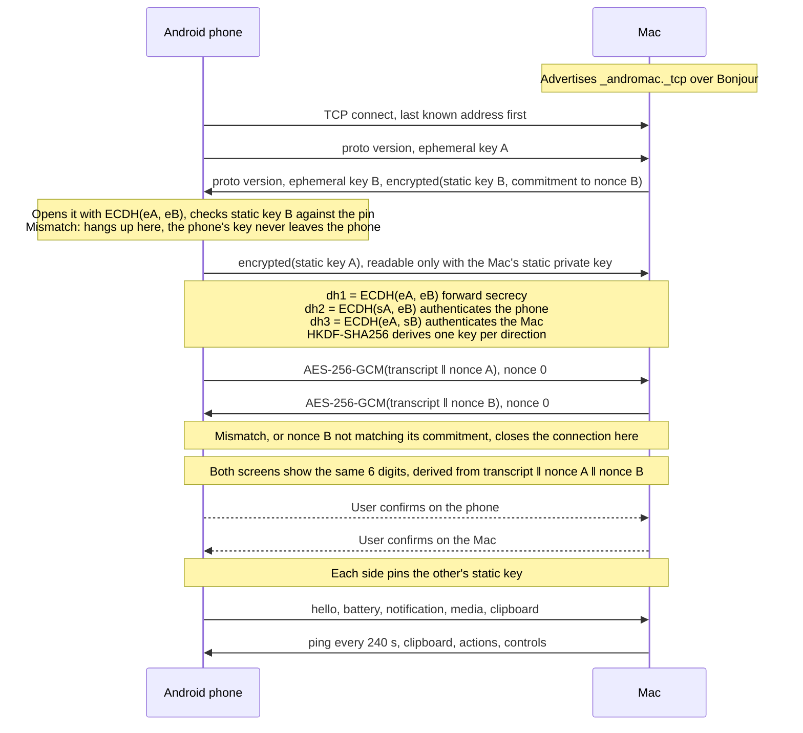
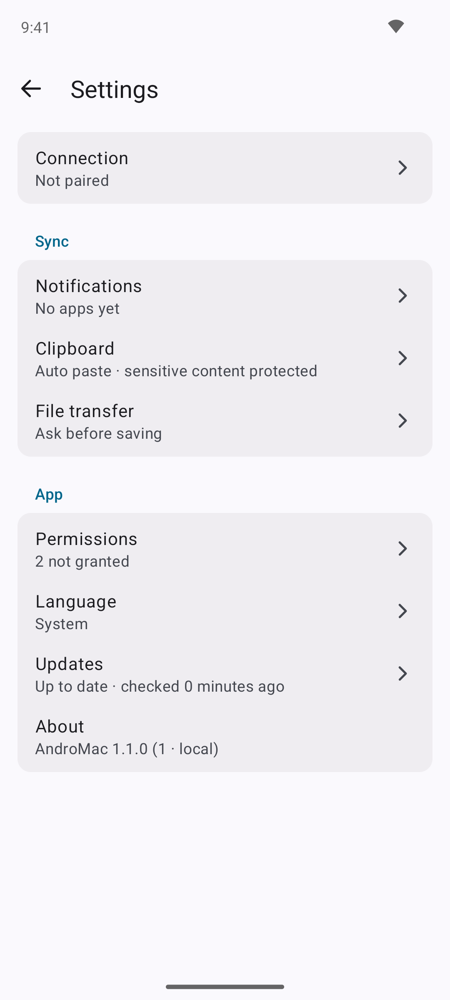

# AndroMac guide

Everything the [README](../README.md) leaves out: install and pairing step by step, each feature
in detail, every setting, troubleshooting, and the trust model. Türkçe: [GUIDE.tr.md](GUIDE.tr.md).

## Install

The packages are on the [releases page](https://github.com/anilmetin0/AndroMac/releases/latest),
with their checksums in `SHA256SUMS.txt`. The Mac build is for Apple Silicon (M1 and later) only;
there is no Intel build. The APK is one file for every phone, since the app has no native code.

### Mac, macOS 14 Sonoma or later

With [Homebrew](https://brew.sh). The tap lives in this repository, so it is added by URL, and
Homebrew 7 loads a tap from outside Homebrew only after you trust it:

```bash
brew tap anilmetin0/andromac https://github.com/anilmetin0/AndroMac
brew trust anilmetin0/andromac
brew install --cask andromac
xattr -dr com.apple.quarantine /Applications/AndroMac.app
```

Without Homebrew, download `AndroMac-<version>-macOS-arm64.dmg`, open it, drag `AndroMac.app` to
**Applications**, and run the `xattr` line above.

The `xattr` line is needed once. The app is signed ad-hoc and not notarized, so macOS refuses the
first launch. Instead of the command you can open the app once, let it be refused, and press
**Open Anyway** in **System Settings → Privacy & Security**.

On first launch:

1. Answer **Always Allow** to the Keychain prompt; the identity key is stored there. If you
   decline, the app runs with a temporary key and says so in the panel, and your pairing stays
   intact.
2. Answer **Allow** to the Local Network prompt. Without it the phone cannot find the Mac.
3. Look for AndroMac in the menu bar, not the Dock. The phone silhouette opens the panel.
4. Optional: Settings → General → **Open at login**.

After that the app updates itself. `brew upgrade --cask andromac` also moves to a new version
once it is out.

### Android 10 or later

On the phone, open the [releases page](https://github.com/anilmetin0/AndroMac/releases/latest),
tap `AndroMac-<version>-android.apk`, and allow installs from your browser when Android asks.

From a Mac, with the phone connected over adb and [GitHub CLI](https://cli.github.com) installed:

```bash
gh release download --repo anilmetin0/AndroMac --pattern '*-android.apk'
adb install AndroMac-*-android.apk
```

Then open AndroMac and grant permissions:

1. The app asks for the notification permission straight away and offers the notification access
   screen once, with the reason.
2. The **Permissions** card on the main screen reads "All permissions granted" or names what is
   missing. Tap a line to open the right system screen. Tapping the card's header opens the full
   list, each marked Required, Recommended or Optional:
   - **Local network access**, required on Android 17 and later. Without it the phone can
     neither find nor reach the Mac. Android files it under Nearby devices.
   - **Allow notifications**, required, so the app can show its own ongoing and clipboard
     notifications.
   - **Notification access**, required, for notification mirroring and for reading the media
     session.
   - **Battery optimization**, recommended, so the system does not cut the connection while the
     screen is off.
   - **Do Not Disturb access**, optional, so the Mac can silence the phone.
   - **Display over other apps**, optional, so the Mac can ask for the clipboard without you
     tapping a notification first.
3. On Android 13 and later the notification access switch is greyed out for sideloaded apps,
   with a message about restricted settings. Try it once so the system registers the attempt,
   then go to **Settings → Apps → AndroMac → ⋮ → Allow restricted settings** and try again.

While a required permission is missing, a banner at the top of the screen says which. Tap it to
open the right screen; the cross hides it until something else is revoked.

[Obtainium](https://github.com/ImranR98/Obtainium) installs and updates the APK straight from the
releases page. Add `https://github.com/anilmetin0/AndroMac` as an app, or open
[obtainium://add/github.com/anilmetin0/AndroMac](obtainium://add/https://github.com/anilmetin0/AndroMac)
on the phone. The release APK is signed with one key across versions, so updates install in
place. Obtainium follows stable releases; turn on its **include prereleases** option to get the
betas too.

### Update check

Both apps check once a day, and both can install what they find. **Settings → Updates** on either
side has the switch and a **Check now** button; the check runs at launch and when the menu bar
panel is opened, never on a timer. A newer build means a greater version, or the same version
built from a different commit. The app offers it once, as `1.0.0 (fd7d47a)`, with
**Install now**, **Later** and **Skip this version**.

Installing is the app's own job from there. It downloads the release asset, checks it against the
`SHA256SUMS.txt` published with that release, and only then replaces itself. The Mac swaps its
bundle and restarts. The phone hands the APK to Android's installer, which asks you to confirm and
enforces the signature. A checksum that is missing or does not match stops the update.

The check is the only time either app talks to a server. It sends one request to api.github.com
carrying only the app version. It is on by default because an app distributed outside any store
has no other way to tell you a fix exists. The switch turns it off, and then nothing leaves your
network. See [Privacy and security](#privacy-and-security).

## Pairing

1. Open AndroMac on the Mac, and make sure both devices are on the same Wi-Fi network.
2. Tap **Pair** on the phone.
3. The same 6 digits should appear on both screens. If they match, confirm on both. If they do
   not, reject: it means the exchange was intercepted.

After that it is automatic. The phone reconnects on its own whenever the network comes back.

While unpaired, both apps show a guide with the live state of every step, so you can see which one
is stuck:

| Step | On the phone | On the Mac |
|---|---|---|
| Is the app open on the Mac | `Mac seen on the network` or `not found` | `This Mac is advertising` |
| Same network | `Phone: 192.168.1.42` | `This Mac: 192.168.1.5` |
| Pair | `Ready` or `Complete the previous steps` | Waiting for the phone |

If it still will not connect, **I can't connect** at the bottom of that guide opens live
diagnostics. They show the phone's address and subnet, whether the Mac was seen, the pairing and
connection state, and the app version, followed by a list of fixes per symptom. Settings → Network on the Mac
shows the same information and links to the Local Network permission.

The Mac's pairing dialog and the phone's both show the digits in large groups. On the phone, a key
that has changed since the last pairing defaults to **Reject**. On the Mac the first phone defaults
to **Pair** and every later request defaults to **Reject**, because an unexpected phone is the
suspicious case.

## Features

| Feature | Direction | What it does |
|---|---|---|
| Battery | Phone to Mac | Level, charging state and temperature. Optional percentage in the menu bar, a bar in the panel, and one warning when the level drops below the threshold you set in Settings → Sync. |
| Clipboard | Mac to phone | Automatically as you copy, or only when you press the button in the panel. Settings → Clipboard holds the choice. A silent notification with a Paste action is the second route, for phones whose manufacturer blocks background clipboard writes. A clipboard marked concealed by a password manager is never sent. |
| Clipboard | Phone to Mac | The Mac asks when you open the panel, and the phone answers. The phone also sends its clipboard whenever you bring AndroMac to the foreground on the phone. You can push it yourself with the Quick Settings tile, the button on the ongoing notification, or the share sheet. See [why this direction is asked for](#why-the-clipboard-is-asked-for-in-one-direction). |
| Clipboard history | Mac | The last 50 entries from both directions. Search, click to copy, right-click to send back to the phone or delete. |
| Notifications | Phone to Mac | They arrive in Notification Center with the app's own icon. Actions, inline reply included, are triggered from the Mac, and dismissing on either device dismisses on the other. |
| Per-app tiers | Both ways | Full, Title only, or Off, set from either device. Applied on the phone: on Off the radio never wakes for that app, on Title only the body never leaves it. |
| Noise filter | Phone | Group summaries, ongoing and foreground-service notifications, local-only notifications and silent channels are dropped before sending. Mirroring can be limited to times when the phone is locked. |
| Notification history | Mac | The last 200 entries, searchable, stored only on the Mac. |
| Media | Both ways | Title, artist and app of the track playing on the phone, with previous, play/pause and next from the Mac. Sent only on change, with no progress bar. |
| Find my phone | Mac to phone | The phone rings at alarm volume and vibrates for at most 30 seconds. Found it, a second request, or the timeout stops it. |
| Phone controls | Mac to phone | Ringer (ring, vibrate, silent) and media volume from the panel, plus a test notification that travels the whole mirroring chain and comes back. Silencing needs Do Not Disturb access on the phone; without it the button is disabled. |
| Files | Both ways | Share from the phone's share sheet, or **Send file…** and drag-and-drop on the Mac panel. The receiver is asked first, unless you turn on auto-accept, which then applies to every paired phone. Files land in Downloads, are checked against a SHA-256 hash, and are never opened for you. See [how it compares](#compared-with-other-tools). |
| Several phones | Mac | More than one Android can be paired and connected at once. With two or more, the panel's device card shows them as tabs across the top, and clicking a tab switches to that phone. Each one can be disconnected and connected on its own. Disconnect hangs up and refuses the next attempt, and each phone has its own clipboard switch. Forgetting a device is in Settings → Devices. |
| Verification codes | Mac | When a mirrored notification carries a one-time code, the panel puts the code itself on a copy button. Copying it does not send it back to the phone and does not enter the clipboard history. |
| Connection guide | Both | Neither app says "cannot connect". Both show which step is stuck, and the phone has a live diagnostics screen. |
| Metrics | Mac | Messages per hour, traffic, reconnect count and the most frequent message types, so you can check the energy claim yourself. |
| Screen mirroring | Phone to Mac | The phone's screen in a window, with mouse, keyboard and sound, through the bundled scrcpy over Wireless debugging or USB. See [Screen mirroring](#screen-mirroring). |
| Updates | Both | Each app checks once a day, offers what it finds at launch, and installs it itself. The download is verified against the checksum published with the release before anything is replaced. One switch turns the check off. |

Out of scope: SMS, call control, more than one Mac, and access over the internet. The design is
any number of phones and one Mac on one local network.

### Screen mirroring

The Mac can show the phone's screen in a window and pass the mouse, the keyboard and the sound
through. That part is [scrcpy](https://github.com/Genymobile/scrcpy), which ships inside the Mac
package together with adb. It does not ride the AndroMac connection. It uses Android's own
debugging channel, so the phone needs one switch that no app can flip for you:

1. On the phone, unlock Developer options by tapping **Build number** seven times, then turn on
   **Wireless debugging**. A USB cable with USB debugging on works too.
2. Press the mirror button on the phone's card in the Mac panel. The first time, the panel asks
   for a pairing code. On the phone open Wireless debugging, then **Pair device with pairing
   code**, and type the six digits into the panel. This pairing is adb's own and happens once per
   Mac.
3. The phone's screen opens in a window. Close the window to stop.

While Wireless debugging is off the panel says so, and **Open on phone** opens that setting on
the phone. The phone reports the switch, so the Mac carries on by itself once it is on. Settings
→ Screen mirroring holds the sound, turning the phone's screen off, keeping it awake and a
resolution cap. While AndroMac syncs the clipboard, scrcpy's own clipboard sync stays off so the
two do not echo each other.

Wireless debugging lets any computer the phone trusted in adb control it, so turn it off when
you are done. A build from source without the bundled copy uses `brew install scrcpy`. What is
bundled, and under which licenses, is in [THIRD-PARTY-NOTICES.md](../THIRD-PARTY-NOTICES.md).

### Why the clipboard is asked for in one direction

Since Android 10 an app cannot read the clipboard unless it is in the foreground. That is a
privacy rule with no supported way around it, so the phone never pushes a copy by itself. It
answers a question. Opening the Mac panel asks the phone for its clipboard, and the phone reads
it through an invisible activity that holds focus for a moment. The phone also sends its
clipboard whenever you bring the AndroMac app to the foreground, since it may read it then.

That activity needs one permission on the phone, **Display over other apps**, the one exemption
an ordinary app has from Android's background-activity rule. Without it the phone posts a
notification with one "Send clipboard" button, and the tile and the share sheet still work. The
share sheet route never touches the clipboard. A phone that grants neither answers
nothing, and nothing in the protocol can read its clipboard.

## Settings

The phone's main screen stays plain. The status card names the Mac: "Connected to …",
"Connecting to …", or, while unpaired, the Macs it can see. Below it sit the four sync switches
for **Battery**, **Clipboard**, **Notifications** and **Media**, and the clipboard history. The
connection guide shows only until the phone is paired; after that the **ⓘ** button in the top
bar opens it together with the live diagnostics. A permissions card appears only while a required
permission is missing. Everything else is behind the **Settings** button in the top bar.

Both apps write the version the same way, as `1.1.0 (12 · abc1234)`: version, build number and
the commit it was built from. It is under Settings → About on the phone. Quote that whole string
in a bug report.

| Screen | What is on it |
|---|---|
| Settings | Connection, Notifications, Clipboard, File transfer, Permissions, Language, Updates and About, each with a one-line summary. |
| Clipboard history | The last 20 texts sent to or received from the Mac, newest first. Tap to copy, the send button to send again. Kept in memory only and never written to storage; sensitive clips are not recorded. |
| Permissions | All six permissions, each marked Granted or Not granted, with Required, Recommended or Optional noted. Tapping one opens the matching system screen. |
| Connection | State, the Mac's name and last address, **Reconnect automatically**, **Connect now**, and **Forget this Mac**. |
| Notification settings | **App filter** with a summary of what is set, **Silent notifications**, and **Only while the phone is locked**. It also lists what is always filtered out. |
| App filter | The three-tier picker for every app the phone has seen, reached from Notification settings. |
| Clipboard settings | Incoming: **Write to the clipboard**, **Show a notification**. Outgoing: **Never send sensitive content**. Plus **Send clipboard to Mac**. |
| Connection help | Live diagnostics, common problems, and how the whole thing works. Reached through the **ⓘ** button, or **I can't connect** in the pairing guide. |
| Updates | The daily update check: switch, **Check now**, and an **Install** button that downloads, verifies and installs the newer build. |
| Files | **Receive files** and **Accept files automatically**. Received files go to Downloads; sending is done from any app's share sheet. |
| Language | Opens the Android per-app language picker, which offers English and Turkish. |

On the Mac the menu bar panel is for glancing. With more than one phone paired, tabs across the
top switch between them. The phone's card shows its name and state, one battery line, the track
that is playing, and the ringer and volume on one row. Below that is one row of buttons: ring the
phone, send a test notification, mirror the screen, and a **⋯** menu with **Send my clipboard
here**, **Device settings…** and **Disconnect**. Clicking the phone's name opens its settings.
Next comes the last clipboard entry, with buttons to ask the phone for its clipboard, send the
Mac's, or send a file; hover it to read the whole text, and press ⌘C to copy it. The four most
recent notifications close the panel. A progress line appears while a file is moving, a status
line only when nothing is paired or the listener is down, and a one-line warning while macOS
notifications are off for AndroMac. Dropping files onto the panel sends them. ⌘, opens
Settings, and right-clicking the menu bar icon opens a menu with Open AndroMac, Settings and Quit.

The window has one sidebar: **Notifications**, **Clipboard** and **Apps** at the top, then every
settings section.

| Page | What is on it |
|---|---|
| Notifications | The history, with search and a clear button. |
| Clipboard | The history, with search, click to copy, right-click to send back or delete. |
| Apps | The tier picker for every app on the phone. |
| Settings | General, Sync, Clipboard, Notifications, Files, Screen mirroring, Devices, Permissions, Network, Updates, Metrics and Privacy. |

General has **Open at login**, **Show battery percentage in the menu bar**, and a
**Language** picker offering System, English and Turkish. Changing the language shows a Restart
button, because the language is read at launch. Sync holds the four switches for **Battery**,
**Clipboard**, **Notifications** and **Media**, the low-battery alert switch, and a threshold
picker with 10, 15, 20 and 30 percent. Clipboard holds the **Mac to phone** choice between
automatic and manual, the concealed clipboard rule, and whether opening the panel asks the phone
for its clipboard. Notifications has **Play a sound for mirrored notifications** and the number
of history entries to keep. Files has **Receive files** and **Accept files automatically**, the
latter for every paired phone. Devices lists every paired phone with its status and holds
**Forget** for each, plus **Forget all devices** when more than one is paired; this Mac's name
and the app version are there too. Permissions shows the state of Notifications, Local Network
and Keychain access, each with a button that opens the matching System Settings pane when it is
not granted. Network shows both addresses with a shortcut to the Local Network permission.
Updates holds the update check described under [Update check](#update-check), and draws a QR
code for the releases page so the APK can be installed on the phone without typing a URL.
Metrics is described under [Energy](#energy). Privacy states what is stored and where.

## Troubleshooting

| Symptom | What to check |
|---|---|
| The phone says the Mac was not found | AndroMac is open on the Mac; both devices are on the same Wi-Fi, not a guest network and not one with AP isolation; the Mac's Local Network permission was granted, reachable from Settings → Network or Settings → Permissions; on Android 17 and later, the phone's Local network access. |
| It connects, then drops | The battery optimization exemption on the phone, and AP isolation on the router. |
| Notifications do not arrive | Notification access, including the Android 13+ restricted settings flow; the app may be on the Off tier; silent notifications are not sent by default. If macOS notifications are off for AndroMac, the panel and Settings → Permissions say so. |
| A "key changed" warning on the phone | Expected if you reinstalled the Mac app: unpair on the phone and pair again. If you did not, reject it. A reinstalled phone arrives on the Mac as a new device, and the old entry stays until you forget it. |
| The Keychain asks on every launch | An ad-hoc signature changes on every build. Use the release package, or build with `CODESIGN_IDENTITY`. |
| The clipboard does not arrive from the phone by itself | That is the Android restriction [described above](#why-the-clipboard-is-asked-for-in-one-direction). Opening the Mac panel asks the phone for it, and opening AndroMac on the phone sends it. For an instant answer grant **Display over other apps** on the phone; otherwise tap the notification it posts, the tile, or the share sheet. |
| Silencing the phone from the Mac does nothing | Grant **Do Not Disturb access** on the phone. Without it Android refuses the change, and the Mac disables the button. |
| Screen mirroring asks for Wireless debugging | Turn on **Wireless debugging** in Developer options, with the phone on the same Wi-Fi as the Mac, or connect a USB cable with USB debugging on. The first time, type the code from **Pair device with pairing code** into the panel. |
| No track shows on the Mac while music is playing | The media session is read through notification access, so grant that first. The Media switch must also be on. |

**I can't connect** on the phone is the live version of this table. It sits in the pairing guide,
which the phone shows while it is unpaired.

## Privacy and security

**Nothing leaves the local network.** There is no server to reach and no account to create, and
the apps collect no telemetry or analytics. The apps open no socket to the internet, with one
exception: the update check in Settings → Updates, on by default. It asks `api.github.com` for
the newest release at most once a day and sends only the app's version in the `User-Agent`
header. Installing an update downloads from `github.com` as well, right after the check when
automatic installs are on (the phone waits for Wi-Fi), otherwise when you press Install. Turn
the switch off and both apps speak only to each other.

What leaves the phone depends on the tier you set per app. On Off, nothing, and the radio does
not wake. On Title only, the app name alone. The title, the body and the action names are sent
empty, so the content never leaves the device. On Full, the title, body and action names.
Clipboard content that a password manager or an OTP field marked with `EXTRA_IS_SENSITIVE` is
never sent; that rule is on by default. The Bonjour record carries only the device name and the
protocol version, and no key material.

Where things are stored:

| What | Where |
|---|---|
| The Mac's identity key | The macOS Keychain |
| The phone's identity key | Wrapped with an AES-256-GCM key that lives in the Android Keystore and cannot be exported. It is unwrapped into memory during the key exchange, which is the ceiling of doing P-256 in software |
| The pinned peer key, the device name and settings | Locally on each device |
| Notification and clipboard history | Only on the Mac, under Application Support. Deleted when you unpair |

Files are the one thing that is written to disk on purpose. A transfer starts only after the
receiver accepted it, or after you turned on auto-accept, which applies to every paired phone.
Nothing is written before that. The file is verified against its SHA-256 hash before it gets its
final name, is never opened for you, and on the Mac carries the same quarantine flag as a browser
download. The name is sanitized on arrival, so a sender cannot pick the directory.

On the wire: P-256 key agreement, HKDF-SHA256, AES-256-GCM with a per-direction counter as the
nonce, so a replayed frame closes the connection. Frames are capped at 1 MiB, and the receiver
enforces its own length limit on every field. The Mac gives a connection 10 seconds to finish its
handshake, holds only a few unverified connections at a time, and rate-limits the pairing prompt.
It rejects peers outside private address ranges, and gives up an established session only after
a new connection has completed its handshake. Another device on your Wi-Fi cannot knock your
phone offline by opening a socket. No log line carries message content or key material.

### Verifying it yourself

The crypto is written twice, independently: CryptoKit on macOS, JCE on Android. Two scripts
prove that the two agree, and both run in CI on every push:

```bash
scripts/verify-crypto.sh       # identical vectors: key encoding, HKDF, nonce layout, GCM tag, SAS
scripts/verify-handshake.sh    # the real Swift and Kotlin session code, over loopback
```

The first compares the two implementations vector by vector. The second runs the actual
`Session.accept` in Swift against the actual `Session.connect` in Kotlin. It checks the frame
order, the confirmation round, the pin check, that the 6-digit code matches on both sides, and
that 12 frames arrive in counter order in each direction.

Both exist because passing one does not imply the other. During development the vectors matched
while the handshake failed, because the second and third Diffie-Hellman operations were ordered
the wrong way round on macOS.

To report a vulnerability, use private reporting as described in [SECURITY.md](../SECURITY.md),
never a public issue.

## How it works

The Mac is the server. It advertises `_andromac._tcp` over Bonjour on a port the system assigns.
The phone is the client: it tries the last address that worked, and only browses for the service
when that fails.



### The trust model

The handshake is a Noise-KK pattern over NIST P-256. Each device has one long-term key pair and
generates a fresh ephemeral pair per session, so a session recorded today cannot be decrypted
later even if a device is compromised. Only the ephemeral keys are ever sent in the clear. The
Mac's long-term key travels encrypted under the ephemeral secret. The phone sends its own only
after checking the Mac's key against the pin, and encrypts it so that only the real Mac can read
it. A listener on the network sees two random per-session keys, and a stranger answering on the
port learns nothing about the phone. The three Diffie-Hellman results are mixed with a transcript
hash through HKDF-SHA256 into one AES-256-GCM key per direction. Both sides then encrypt the
transcript and check what the other sent. A mismatch closes the connection before any
application message is read.

The handshake alone does not prove *which* devices are talking, only that nobody is in the
middle of this particular exchange. The 6-digit code covers that. It is derived from the whole
handshake transcript plus one random nonce from each side, and the Mac commits to its nonce
with a hash before the phone reveals its own. A device in the middle has to fix its half of each
code before it can see the other half, so it gets one guess in a million per attempt. Every
failed attempt is a visible mismatch on your screens. A code derived from the static keys alone
would not have this property. The attacker could grind key pairs offline until both screens
agreed, which is the class of weakness KDE Connect fixed in 2025. Compare the digits, confirm on
both devices, and each side pins the other's static public key permanently.

From then on the pin is the check. On the phone, which pins one Mac, this is absolute. On the
Mac, which pins a set of phones, a key it has not met is an unknown device and gets an ordinary
first-contact prompt. A key that does not match byte for byte is rejected and reported as a
changed key. It is never accepted or re-pinned on its own, and tapping Pair again does not clear
it. If you see that warning without having reinstalled either app, something is wrong and you
should reject it. Rejecting a code on the Mac also mutes that key for a growing while, one
minute doubling up to an hour, so a stranger cannot turn the prompt into a nag. The Bonjour
record carries no key and plays no part in this decision; only the key proven during the
handshake does. The same goes for names. The name in the Bonjour record is only used to find the
Mac, and the name shown after connecting comes from inside the encrypted session.

The full wire format is in [docs/PROTOCOL.md](PROTOCOL.md).

### Compared with other tools

Before adding file transfer, the trust models and transfer protocols of Syncthing, LocalSend,
KDE Connect, Quick Share, AirDrop, Magic Wormhole and Blip were read side by side. Where a design
had a documented weakness or a published advisory, AndroMac does it differently.

| Question | Elsewhere | AndroMac |
|---|---|---|
| Who can talk to the app? | LocalSend accepts a transfer from any device on the LAN behind an optional PIN; its fingerprint is remembered, never verified ([issue #162](https://github.com/localsend/localsend/issues/162)). KDE Connect and Syncthing accept unauthenticated discovery packets and decide trust later. | Only the one pinned key can complete a handshake. There is no per-transfer PIN because pairing is the PIN, and discovery is a hint the handshake has to prove. |
| Can the code shown at pairing be forged? | KDE Connect's 8-hex-character code was a hash of the two certificates and could be brute-forced ([advisory, April 2025](https://kde.org/info/security/advisory-20250418-3.txt)); the fix mixes in a timestamp. | The code is bound to a fresh transcript and to nonces exchanged under a commitment, so it cannot be ground offline and every attempt costs a visible mismatch. |
| Is the shown device name trustworthy? | KDE Connect displayed the name from the cleartext discovery packet even for paired peers, so it could be spoofed. AirDrop broadcasts hashes of your phone number and e-mail to anyone nearby, reversible in milliseconds ([PrivateDrop, USENIX 2021](https://privatedrop.github.io/)). | The name shown after connecting comes from the encrypted `hello`. The Bonjour record carries a name and the protocol version, with no key and nothing tied to an account or a person. |
| What happens before you press Accept? | Quick Share processed payload frames before the accept response, which chained into remote code execution ([CVE-2024-38272](https://www.safebreach.com/blog/rce-attack-chain-on-quick-share/)). LocalSend's Quick Save accepts from anyone. | Nothing is written to disk before `file_accept`; a chunk for an unaccepted id is dropped without allocating. Auto-accept exists, but only for the pinned device. |
| Is the file checked? | KDE Connect relies on TLS alone, no application-layer hash. Syncthing hashes every block. LocalSend's hash is optional. | Every chunk is bounded (512 KiB) and the whole file is verified against SHA-256 before it is renamed into place; until then it is a `.part` file or a pending media entry. |
| What about the file name? | Quick Share's chain included a path traversal on the receiver. AirDrop appends " 2" after the extension for unknown types. | The receiver keeps only the last path component, strips control characters and leading dots, caps the length, and numbers duplicates before the extension. |
| Is the received file opened? | KDE Connect has an `open` flag that launches the file on arrival. | Never. macOS marks it with the same quarantine flag a browser download gets; Android puts it in Downloads through MediaStore, so the app needs no storage permission. |
| Can a stranger exhaust the app? | KDE Connect could be held open with unauthenticated connections ([CVE-2020-26164](https://nvd.nist.gov/vuln/detail/CVE-2020-26164)). | Four pending handshakes at most, 10 seconds each, one pairing prompt per 30 seconds, one transfer at a time per direction, and a bounded 8-chunk window (4 MiB) so a peer cannot grow the phone's heap. |
| Does anything leave the LAN? | Blip and Magic Wormhole relay through the internet when a direct path fails; Syncthing has global discovery and relays. | Never. There is no relay to fall back to. |

Some ideas were borrowed as they are: LocalSend's offer-then-accept flow with a per-transfer id,
Syncthing's chunk-and-hash discipline and temp-file-then-rename, Quick Share's idea of a short
number confirmed on both screens, and the accept dialog that names the sender and the size before
anything happens. Magic Wormhole's password-authenticated key exchange suits two strangers and is
unnecessary here. With pinned long-term keys, mutual authentication is already solved, and a
per-transfer code would add taps without adding security.

What the network still sees: the Mac's name in its Bonjour record, and the fact that a phone
connected to it. Both long-term keys are encrypted in the handshake, so a passive listener
cannot tell *which* phone. An active one learns the Mac's key, because the Mac is the
discoverable side. That key is random and carries no name or account.

## Energy

The radio waking up is what drains a phone battery; the amount of data matters much less. So the
phone sets up no periodic timer. The Mac is on wall power, so the Mac does the liveness check
with a ping every 240 seconds and the phone only answers. Battery reports ride on a broadcast the
system already sends, at most once a minute. Notifications and media are event-driven with short
coalescing windows. Filtering happens on the phone, before the radio wakes, and the mDNS browse
stops the moment a connection is up.

The whole rule set, and how to measure it with `dumpsys batterystats`, is in
[docs/ENERGY.md](ENERGY.md). Settings → Metrics on the Mac should show roughly 30 messages
per hour for each connected phone when idle. Noticeably more means one of the rules has been broken.

## Screenshots

<table>
<tr>
<td align="center"></td>
<td align="center"></td>
<td align="center"></td>
<td align="center"></td>
</tr>
<tr>
<td colspan="2" align="center"></td>
<td colspan="2" align="center"></td>
</tr>
<tr>
<td colspan="4" align="center"></td>
</tr>
<tr>
<td colspan="4" align="center"></td>
</tr>
<tr>
<td colspan="4" align="center"></td>
</tr>
</table>

## Building and contributing

[CONTRIBUTING.md](../CONTRIBUTING.md) has the toolchain, the build, the tests, the repository
layout and how to add a language. [RELEASING.md](RELEASING.md) describes the release pipeline,
[PROTOCOL.md](PROTOCOL.md) the wire format and [ENERGY.md](ENERGY.md) the energy rules.

Licensed under the [MIT License](../LICENSE).
