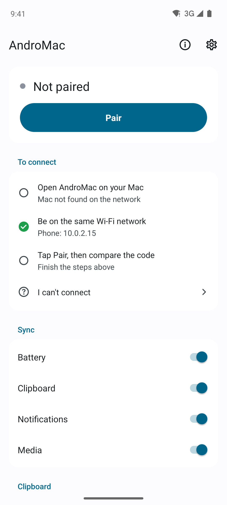
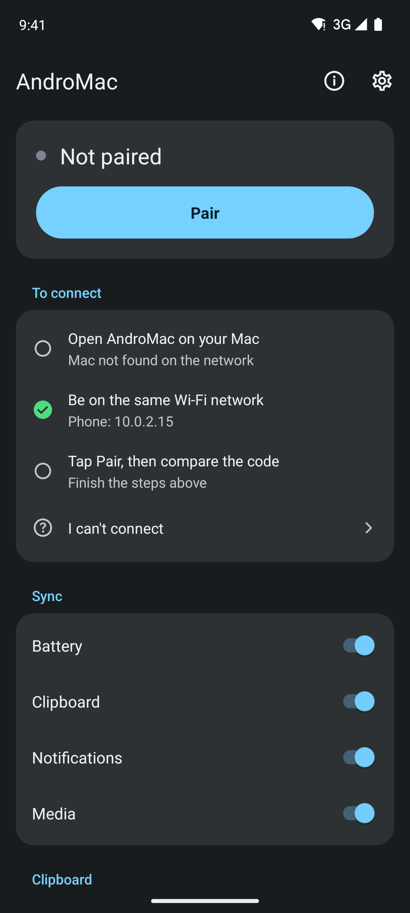
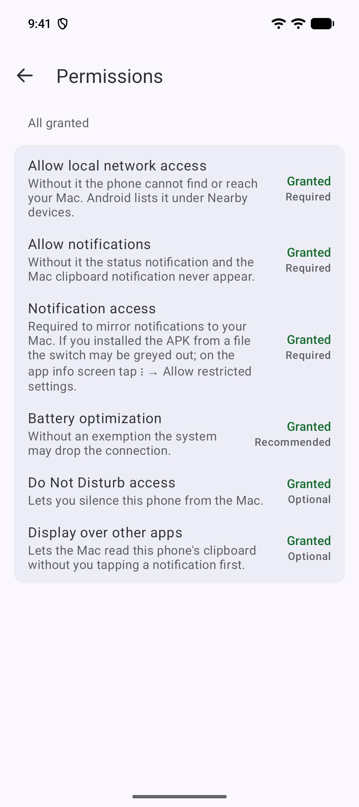
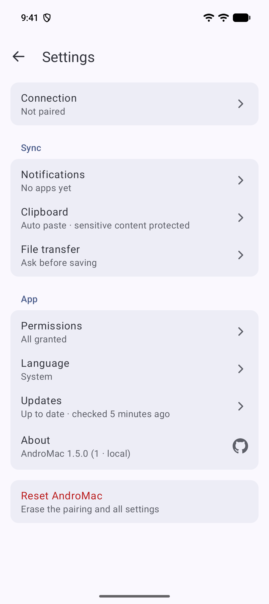
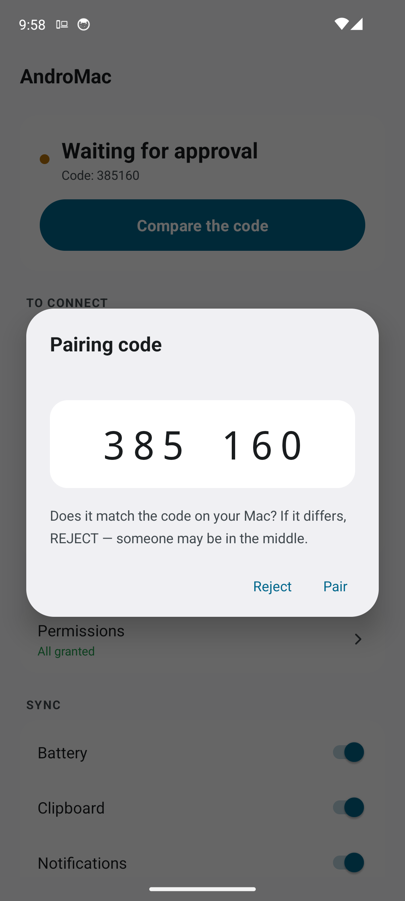
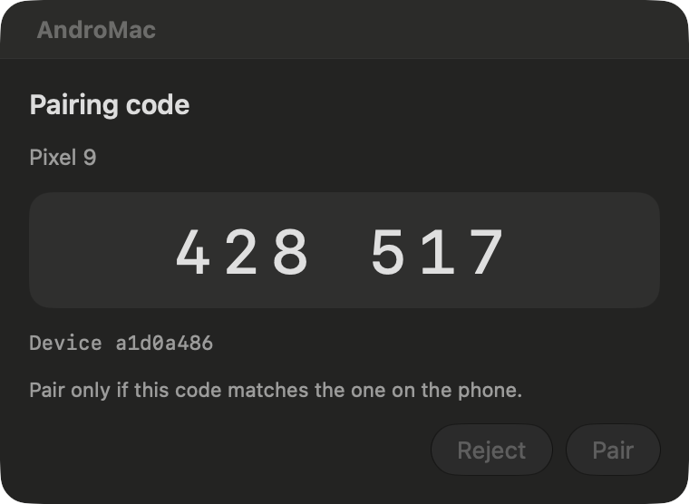
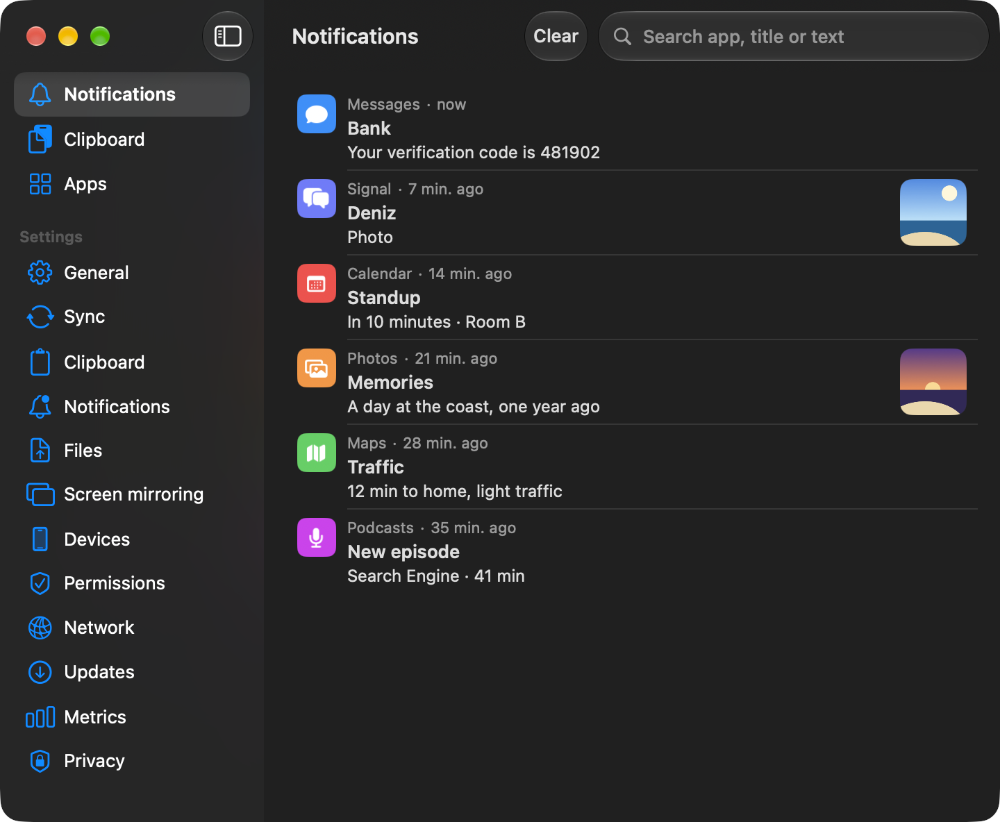
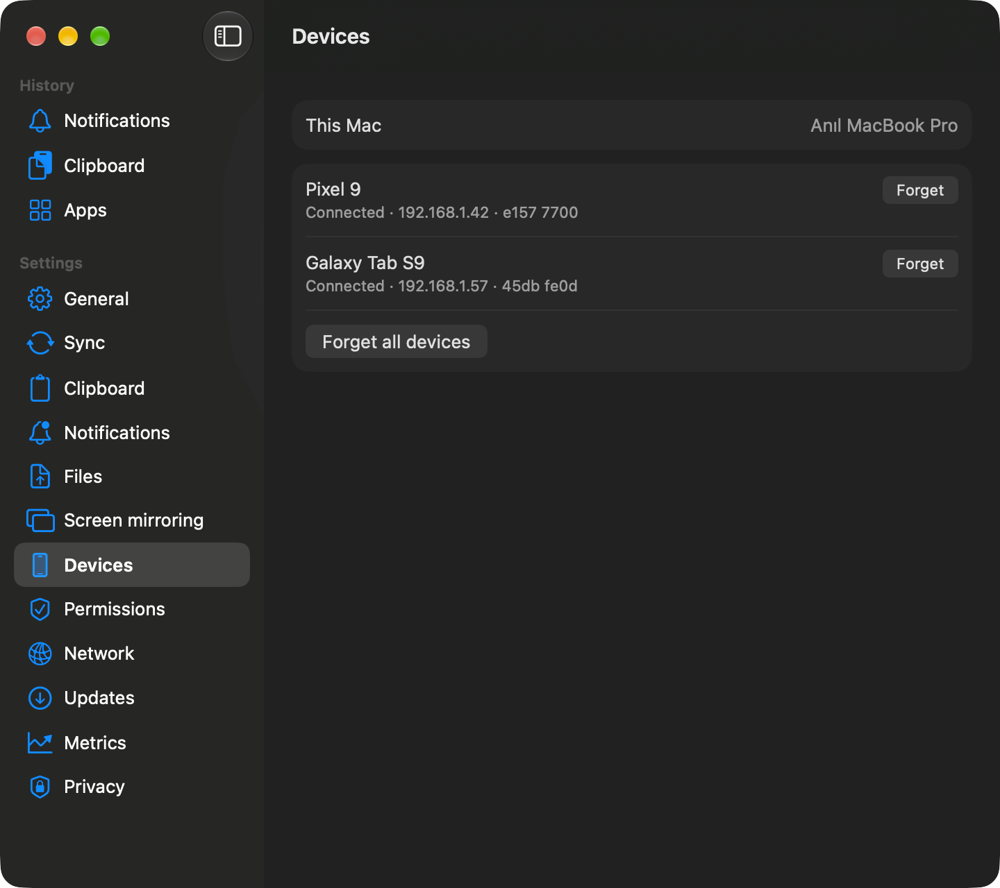
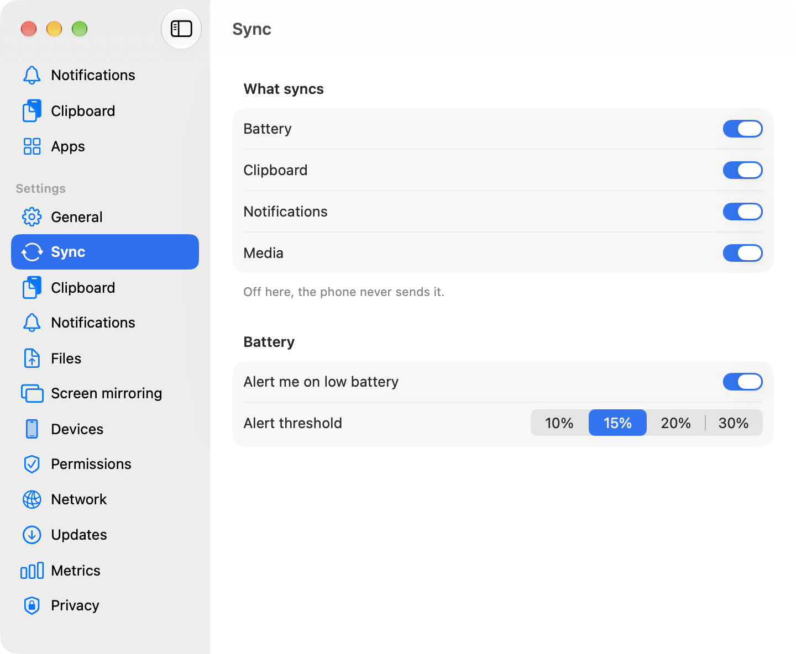

# AndroMac rehberi

Bu rehber kurulumu ve eşleştirmeyi adım adım anlatır, sonra her özelliği, her ayarı ve bir şey
çalışmadığında ne yapacağını açıklar. English: [GUIDE.md](GUIDE.md).

## Kurulum

Paketler [yayın sayfasında](https://github.com/anilmetin0/AndroMac/releases/latest), sağlama
toplamları da yanlarındaki `SHA256SUMS.txt` dosyasında. Mac uygulaması yalnızca Apple Silicon
(M1 ve sonrası) üzerinde çalışır. Aynı APK her Android telefonda çalışır.

### Mac, macOS 14 Sonoma ve üstü

[Homebrew](https://brew.sh) ile. Tap bu deponun içinde olduğu için URL ile eklenir ve Homebrew
ona güvenmeni ister:

```bash
brew tap anilmetin0/andromac https://github.com/anilmetin0/AndroMac
brew trust anilmetin0/andromac
brew install --cask andromac    # en yeni derleme için andromac@nightly
xattr -dr com.apple.quarantine /Applications/AndroMac.app
```

Homebrew olmadan: `AndroMac-<sürüm>-macOS-arm64.dmg` dosyasını indir, aç, `AndroMac.app`'i
**Uygulamalar**'a sürükle ve yukarıdaki `xattr` satırını çalıştır.

Uygulama Apple'ın noter onayından geçmediği için macOS ilk açılışı engeller. `xattr` satırı bunu
bir kez çözer. Ya da uygulamayı açmayı dene, macOS reddedince **Sistem Ayarları → Gizlilik ve
Güvenlik**'te **Yine de Aç**'a bas.

İlk açılışta:

1. Anahtar Zinciri sorusuna **Always Allow** de. Reddedersen uygulama yine çalışır, panel geçici
   bir anahtar kullandığını söyler.
2. Yerel Ağ sorusuna **İzin ver** de. Verilmezse telefon Mac'i bulamaz.
3. AndroMac Dock'ta değil, menü çubuğunda durur. Paneli açmak için telefon simgesine tıkla.
4. İsteğe bağlı: Ayarlar → Genel → **Oturum açınca başlat**.

### Android 10 ve üstü

Telefonda [yayın sayfasını](https://github.com/anilmetin0/AndroMac/releases/latest) aç,
`AndroMac-<sürüm>-android.apk` dosyasına dokun ve Android sorduğunda tarayıcından kuruluma izin
ver.

Mac'ten, telefon adb ile bağlıyken ve [GitHub CLI](https://cli.github.com) kuruluyken:

```bash
gh release download --repo anilmetin0/AndroMac --pattern '*-android.apk'
adb install AndroMac-*-android.apk
```

Sonra AndroMac'i aç ve izinleri ver:

1. Uygulama bildirim iznini hemen ister, ardından bildirim erişimi ekranını önerir.
2. Zorunlu bir izin eksikken ana ekranın üstünde onu gösteren bir kart çıkar. Bir satıra dokununca
   ilgili sistem ekranı açılır. Çarpı, başka bir izin eksilene kadar kartı gizler. Tam liste
   Ayarlar → İzinler'de:
   - **Yerel ağ erişimi**, Android 17 ve üstünde zorunlu. Verilmezse telefon Mac'i bulamaz, ona
     bağlanamaz. Android bunu Yakındaki cihazlar altında gösterir.
   - **Bildirimlere izin ver**, zorunlu; uygulamanın kendi bildirimleri için.
   - **Bildirim erişimi**, zorunlu; bildirim aynası ve çalan müzik bilgisi için.
   - **Pil optimizasyonu**, önerilir; ekran kapalıyken Android bağlantıyı kesmesin diye.
   - **Rahatsız Etmeyin erişimi**, isteğe bağlı; Mac'in telefonu sessize alabilmesi için.
   - **Diğer uygulamaların üzerinde göster**, isteğe bağlı; Mac telefonun panosunu istediğinde
     bildirime dokunman gerekmesin diye.
3. Android 13 ve üstünde, dosyadan kurulan uygulamalarda bildirim erişimi anahtarı gri görünür.
   Bir kez açmayı dene, sonra **Ayarlar → Uygulamalar → AndroMac → ⋮ → Kısıtlı ayarlara izin ver**
   yolunu izleyip tekrar dene.

[Obtainium](https://github.com/ImranR98/Obtainium) APK'yı yayın sayfasından kurup güncelleyebilir.
Uygulama olarak `https://github.com/anilmetin0/AndroMac` adresini ekle ya da telefonda
[obtainium://add/github.com/anilmetin0/AndroMac](obtainium://add/https://github.com/anilmetin0/AndroMac)
bağlantısını aç. Obtainium kararlı sürümleri izler. Nightly sürümler için bunun yerine
uygulamanın güncelleme ayarlarında **Nightly sürümler**'i aç.

### Güncellemeler

İki uygulama da günde bir kez güncelleme denetler ve bulduğunu kendisi kurabilir. İki tarafta da
**Ayarlar → Güncellemeler**'de denetim anahtarı, **Güncellemeleri otomatik kur** ve **Nightly
sürümler** var. Mac'te ayrıca **Şimdi denetle** düğmesi var. Telefonda tek bir düğme, bekleyen işe
göre denetler, indirir ya da kurar. Yeni sürüm **Şimdi kur**, **Sonra** ve **Bu sürümü atla**
seçenekleriyle önerilir.

Uygulama kurmadan önce indirdiği dosyayı o yayınla gelen `SHA256SUMS.txt` ile karşılaştırır,
uyuşmazsa durur. Mac kendini değiştirip yeniden başlar. Telefonda Android'in kurucusu onay ister.
Homebrew ile kurulan Mac `brew upgrade` ile güncellenir.

Güncelleme denetimi ve indirme GitHub'a gider. Geri kalan her şey telefonunla Mac'in arasında
kalır. Elle güncellemeyi tercih edersen denetimi Ayarlar → Güncellemeler'den kapatabilirsin.

## Eşleştirme

1. Mac'te AndroMac'i aç. Telefonla Mac'in aynı Wi-Fi ağında olduğundan emin ol.
2. Telefonda **Eşleştir**'e dokun. Telefon ağda bulduğu Mac'leri adı ve IP adresiyle listeler.
   Kendi Mac'ini seç. Listede yoksa **Yeniden ara**'ya dokun.
3. Mac'in eşleştirme penceresi telefonun IP adresini gösterir. İki ekranda da aynı
   6 hane çıkar. Aynıysa ikisinde de onayla, değilse reddet.

Sonrasında ağ geri geldiğinde telefon kendi başına yeniden bağlanır.

Eşleştirilmemişken iki uygulama da kısa bir kontrol listesi gösterir; hangi adımın takıldığını
oradan görürsün:

| Adım | Telefonda | Mac'te |
|---|---|---|
| Mac'te uygulama açık mı | `Mac ağda görüldü` ya da `bulunamadı` | `Bu Mac ağda yayında` |
| Aynı ağ | `Telefon: 192.168.1.42` | `Bu Mac: 192.168.1.5` |
| Eşleştirme | `Hazır` ya da `Önceki adımları tamamla` | Telefon bekleniyor |

Yine de bağlanmıyorsa listenin altındaki **Bağlanamıyorum** canlı tanı ekranını açar: telefonun
adresi, Mac'in görülüp görülmediği, bağlantı durumu, uygulama sürümü ve sık sorunlara çözümler.
Mac'te Ayarlar → Ağ aynı bilgiyi gösterir.

Mac'teki eşleştirme penceresi her zaman **Reddet** seçili açılır; bir telefon ancak sen
**Eşleştir**'e tıklayınca eşleşir.

### Birden fazla Mac

Bir telefon birden fazla Mac ile eşleşebilir. Her birini aynı yolla eşleştir. Telefonda Ayarlar →
Bağlantı kayıtlı Mac'leri listeler; birine dokunarak ona geçersin.

### Bağlantıyı kesme

Telefonu bir süreliğine Mac'ten ayırmak için AndroMac bildirimindeki, Ayarlar → Bağlantı'daki ya
da Hızlı Ayarlar'daki AndroMac bağlantısı karesindeki **Bağlantıyı kes**'e dokun. Telefon sen
yeniden **Bağlan**'a dokunana kadar bağlanmaz. Mac'te **Bağlantıyı kes**, paneldeki telefonun
**⋯** menüsünde.

## Özellikler

| Özellik | Yön | Ne yapar |
|---|---|---|
| Pil | Telefondan Mac'e | Seviye, şarj durumu ve sıcaklık. Menü çubuğunda isteğe bağlı yüzde; seviye Ayarlar → Eşitleme'de seçtiğin eşiğin altına düşünce bir uyarı. |
| Pano | Mac'ten telefona | Kopyaladıkça gider (Ayarlar → Pano) ya da pano geçmişindeki Telefona gönder ile elle. Telefon arka planda panoya yazamıyorsa Yapıştır düğmeli bir bildirim gösterir. Parola yöneticisinin gizli işaretlediği metin hiç gönderilmez. |
| Pano | Telefondan Mac'e | Paneli açtığında Mac ister. Telefonda AndroMac'i açtığında da gider. Kendin göndermek için Hızlı Ayarlar karesi, bildirimdeki düğme ve paylaşım menüsü var. Bkz. [neden böyle çalışıyor](#telefonun-panosu-neden-isteniyor). |
| Pano geçmişi | Mac | İki taraftan son 50 kayıt. Arama, tıklayınca kopyalama, sağ tıkla telefona geri gönderme ya da silme. |
| Bildirimler | Telefondan Mac'e | Uygulamanın kendi ikonuyla Bildirim Merkezi'ne düşer. Yanıt dahil eylemlerini Mac'ten kullanabilirsin. Bir cihazda kapatınca diğerinde de kapanır. |
| Uygulama başına ayar | İki yön | Tam, Sadece başlık ya da Kapalı; iki cihazdan da ayarlanır. Kapalı o uygulama için hiçbir şey göndermez. Sadece başlık, metni göndermeden yalnızca uygulamanın adını gönderir. |
| Eleme | Telefon | Grup özetleri, kalıcı bildirimler ve sessiz bildirimler atlanır. Aynalama yalnızca telefon kilitliyken çalışacak biçimde sınırlanabilir. |
| Bildirim geçmişi | Mac | Aranabilir son 200 kayıt, yalnızca Mac'te. |
| Medya | İki yön | Telefonda çalanın başlığı, sanatçısı ve uygulaması; Mac'ten önceki, oynat/duraklat ve sonraki. |
| Telefonu bul | Mac'ten telefona | Telefon en fazla 30 saniye alarm sesiyle çalar ve titrer. "Buldum", ikinci bir basış ya da süre dolması durdurur. |
| Telefon denetimleri | Mac'ten telefona | Panelden zil modu (zil, titreşim, sessiz) ve medya ses düzeyi, bir de test bildirimi. Sessize almak telefonda Rahatsız Etmeyin erişimi ister. |
| Dosyalar | İki yön | Telefonda paylaşım menüsünden, Mac'te dosyaları panele bırakarak. Otomatik kabulü açmadıysan alıcıya önce sorulur. Dosyalar İndirilenler'e iner, gelince denetlenir ve kendiliğinden açılmaz. |
| Birden fazla telefon | Mac | Aynı anda birden fazla telefon bağlanabilir. Panel onları sekme olarak gösterir. Her birinin bağlantısı ayrı kesilebilir, her birinin kendi pano anahtarı var. Ayarlar → Cihazlar her telefonu IP adresi ve en son ne zaman görüldüğüyle listeler; unutma da oradan yapılır. |
| Birden fazla Mac | Telefon | Telefon birden fazla Mac'i hatırlar, Ayarlar → Bağlantı'dan aralarında geçiş yapılır. |
| Doğrulama kodları | Mac | Bildirimde tek kullanımlık kod varsa Mac bildiriminde Kodu kopyala çıkar, panel de kod için bir kopyalama düğmesi gösterir. Kodun yanında kod, şifre, OTP ya da code gibi bir sözcük olmalı. Kopyalanan kodlar pano geçmişine girmez. |
| Ölçümler | Mac | Saatlik mesaj, trafik, yeniden bağlanma ve en sık mesaj tipleri. |
| Ekran yansıtma | Telefondan Mac'e | Telefonun ekranı bir pencerede; fare, klavye ve sesle. Kablosuz hata ayıklama ya da USB üzerinden. Bkz. [Ekran yansıtma](#ekran-yansıtma). |
| Güncellemeler | İki taraf | İki uygulama da günde bir kez denetler ve güncellemeyi kendisi kurar. Bkz. [Güncellemeler](#güncellemeler). |

Olmayanlar: SMS, aramalar ve internet üzerinden erişim. Telefonla Mac'in aynı yerel ağda olması
gerekir.

### Ekran yansıtma

Mac, telefonun ekranını bir pencerede gösterip fareyi, klavyeyi ve sesi telefona aktarabilir. Bunu
Mac uygulamasıyla birlikte, adb ile beraber gelen [scrcpy](https://github.com/Genymobile/scrcpy)
yapar. Android'in hata ayıklama bağlantısını kullandığı için telefonda bir ayarı kendin açman
gerekir:

1. Telefonda **Derleme numarası**na yedi kez dokunarak Geliştirici seçeneklerini aç, sonra
   **Kablosuz hata ayıklama**yı aç. USB hata ayıklama açıkken USB kablo da olur.
2. Mac panelinde telefonun kartındaki yansıtma düğmesine bas. İlk seferde panel bir eşleme kodu
   ister. Telefonda Kablosuz hata ayıklama içinden **Cihazı eşleme koduyla eşle**'yi aç ve altı
   haneyi panele yaz. Bunu her Mac için bir kez yaparsın.
3. Telefonun ekranı bir pencerede açılır. Durdurmak için pencereyi kapat.

Kablosuz hata ayıklama kapalıyken panel bunu söyler; **Telefonda aç** o ayarı telefonda açar. Ayar
açılınca Mac kendiliğinden devam eder. Ayarlar → Ekran yansıtma'da ses, telefon ekranını kapatma,
uyanık tutma ve çözünürlük sınırı var.

Kablosuz hata ayıklama açıkken telefonun daha önce güvendiği her bilgisayar onu kontrol edebilir;
işin bitince kapat. Uygulamayla gelen kopya olmadan kaynaktan derlenen sürüm `brew install scrcpy`
ile kurulanı kullanır. Uygulamayla neyin hangi lisansla geldiği
[THIRD-PARTY-NOTICES.md](../THIRD-PARTY-NOTICES.md) dosyasında.

### Telefonun panosu neden isteniyor

Android 10'dan beri bir uygulama panoyu yalnızca ekrandayken okuyabiliyor. Bu yüzden telefon
panosunu kendiliğinden göndermez; paneli açtığında Mac ister. Telefon da bir anlığına görünmez bir
ekran açıp panoyu okur. Telefonda AndroMac'i açtığında da pano gider.

Bu görünmez ekran telefonda **Diğer uygulamaların üzerinde göster** iznini ister. İzin yoksa
telefon onun yerine "Panoyu gönder" düğmeli bir bildirim gösterir; kare ve paylaşım menüsü de
çalışmaya devam eder.

## Ayarlar

### Telefonda

Ana ekran telefonun hangi Mac'e bağlı olduğunu, **Pil durumu**, **Pano**, **Bildirimler** ve
**Medya** için dört eşitleme anahtarını ve pano geçmişini gösterir. Eşleştirme listesi telefon
eşleşene kadar görünür; sonra üst çubuktaki **ⓘ** düğmesi onu canlı tanıyla birlikte açar. Geri
kalan her şey üst çubuktaki **Ayarlar**'da.

Sürüm `1.1.0 (12 · abc1234)` biçiminde yazılır: sürüm, derleme numarası ve commit. Ayarlar →
Hakkında'da durur. Hata bildirirken bu satırın tamamını kopyala.

| Ekran | İçinde ne var |
|---|---|
| Ayarlar | Bağlantı, Bildirimler, Pano, Dosya aktarımı, İzinler, Dil, Güncellemeler ve Hakkında. En altta **AndroMac'i sıfırla** önce sorar, sonra eşleştirmeleri, bütün ayarları ve pano geçmişini siler. |
| Pano geçmişi | Mac'e giden ya da Mac'ten gelen son 20 metin. Dokununca kopyalanır, gönder düğmesi yeniden gönderir. Yalnızca bellekte tutulur; hassas metinler kaydedilmez. |
| İzinler | Altı iznin tamamı; verilip verilmediği ve zorunlu olup olmadığıyla. Birine dokununca ilgili sistem ekranı açılır. |
| Bağlantı | Bağlantı durumu, kayıtlı Mac'ler ve son adresleri, **Otomatik yeniden bağlan**, **Bağlan** ya da **Bağlantıyı kes**, ve **Bu Mac'i unut**. |
| Bildirim ayarları | **Uygulama filtresi**, **Sessiz bildirimler** ve **Sadece telefon kilitliyken**; bir de her zaman atlananların listesi. |
| Uygulama filtresi | Telefonun gördüğü her uygulama için Tam, Sadece başlık ya da Kapalı. |
| Pano ayarları | Gelen: **Panoya otomatik yaz**, **Bildirim göster**. Giden: **Hassas içeriği gönderme**. Bir de **Panoyu Mac'e gönder**. |
| Bağlantı yardımı | Canlı tanı ve sık sorunlar. **ⓘ** düğmesinden ya da **Bağlanamıyorum**'dan açılır. |
| Güncellemeler | Bkz. [Güncellemeler](#güncellemeler). |
| Dosyalar | **Mac'ten dosya al** ve **Dosyaları otomatik kabul et**. Dosyalar İndirilenler'e iner. Göndermek için herhangi bir uygulamanın paylaşım menüsünü kullan. |
| Dil | Android'in uygulama başına dil seçicisi; İngilizce ve Türkçe. |

### Mac'te

Menü çubuğu paneli hızlıca göz atmak içindir. Birden fazla telefon eşliyse üstteki sekmeler
aralarında geçiş yapar. Telefonun kartı adını ve durumunu, pilini, çalanı, zil modunu ve ses
düzeyini gösterir. Altında telefonu çaldırma, test bildirimi gönderme ve ekranı yansıtma
düğmeleri, bir de **Panomu buraya gönder**, **Cihaz ayarları…** ve **Bağlantıyı kes**'i taşıyan
**⋯** menüsü var. Sonra son pano kaydı ve en son dört bildirim gelir. Dosya göndermek için panele
bırak. ⌘, Ayarlar'ı açar. Menü çubuğu simgesine sağ tıklayınca AndroMac'i aç, Ayarlar ve Çık
çıkar.

Pencerenin kenar çubuğunda üstte **Bildirimler**, **Pano** ve **Uygulamalar**, altında ayar
sayfaları var.

| Sayfa | İçinde ne var |
|---|---|
| Bildirimler | Bildirim geçmişi; arama ve temizleme düğmesi. |
| Pano | Pano geçmişi. Tıklayınca kopyalar, sağ tıkla geri gönderir ya da siler. |
| Uygulamalar | Telefondaki her uygulama için Tam, Sadece başlık ya da Kapalı. |
| Genel | **Oturum açınca başlat**, **Menü çubuğunda pil yüzdesi** ve **Dil** (Sistem, İngilizce, Türkçe; yeniden başlatma ister). **AndroMac'i sıfırla…** eşleşmiş telefonları, iki geçmişi, bütün ayarları ve bu Mac'in anahtarını silip yeniden başlatır. Her telefonun yeniden eşleşmesi gerekir. |
| Eşitleme | Dört eşitleme anahtarı, düşük pil uyarısı ve eşiği (%10, %15, %20 ya da %30). |
| Pano | Mac'in panosunun otomatik mi elle mi gönderileceği, panel açılınca telefonun panosunun istenip istenmeyeceği. |
| Bildirimler | Yansıtılan bildirimler için ses, geçmişte kaç kayıt olduğu. |
| Dosyalar | **Dosya al** ve **Dosyaları otomatik kabul et**. |
| Ekran yansıtma | Ses, telefon ekranını kapatma, uyanık tutma, çözünürlük sınırı. |
| Cihazlar | Eşleşmiş her telefon; durumu, yerel IP adresi ve en son ne zaman görüldüğüyle, her biri için **Unut** düğmesiyle. Bu Mac'in adı ve uygulama sürümü de burada. |
| İzinler | Bildirimler, Yerel Ağ ve Anahtar Zinciri erişimi; her biri ilgili Sistem Ayarları bölmesini açan bir düğmeyle. |
| Ağ | Mac'in ve telefonun adresleri, Yerel Ağ iznine bir kestirmeyle. |
| Güncellemeler | Bkz. [Güncellemeler](#güncellemeler). APK'yı telefona kurmak için yayın sayfasının QR kodu da burada. |
| Ölçümler | Her telefon için saatlik mesaj, trafik ve yeniden bağlanma. |
| Gizlilik | Bu Mac'te neyin saklandığı ve ne zaman silindiği. |

## Sorun giderme

| Sorun | Neye bakmalı |
|---|---|
| Telefon Mac'i bulamıyor | Mac'te AndroMac açık mı? İki cihaz da aynı Wi-Fi'da mı, misafir ağı ya da istemci izolasyonu olan bir ağ değil mi? Mac'te Yerel Ağ izni verildi mi (Ayarlar → İzinler)? Android 17 ve üstünde telefonda Yerel ağ erişimi verildi mi? |
| Bağlanıyor, sonra kopuyor | Telefonda pil optimizasyonu muafiyeti ve modemdeki AP izolasyonu. |
| Bildirimler gelmiyor | Telefonda bildirim erişimi, Android 13+ kısıtlı ayarlar adımı dahil. Uygulama Kapalı'ya ayarlı olabilir. Sessiz bildirimler varsayılan olarak gönderilmez. macOS bildirimleri AndroMac için kapalıysa panel bunu söyler. |
| Telefon, Mac'in anahtarının değiştiğini söylüyor | Mac uygulamasını yeniden kurduysan normal: telefonda Mac'i unut ve yeniden eşleştir. Hiçbir şeyi yeniden kurmadıysan reddet. Yeniden kurulan bir telefon Mac'te yeni cihaz olarak görünür; eski kaydı Ayarlar → Cihazlar'dan unut. |
| Anahtar Zinciri güncellemeden sonra yine soruyor | Yayın derlemeleri Apple Developer ID ile imzalı olmadığı için Anahtar Zinciri her güncellemede bir kez sorabilir. **Always Allow** de. |
| Telefonun panosu Mac'e kendiliğinden gelmiyor | [Yukarıda anlatılan](#telefonun-panosu-neden-isteniyor) Android sınırı. Mac panelini aç ya da telefonda AndroMac'i aç. **Diğer uygulamaların üzerinde göster** iznini verirsen dokunmadan çalışır. |
| Mac'ten telefon sessize alınmıyor | Telefonda **Rahatsız Etmeyin erişimi** ver. |
| Ekran yansıtma Kablosuz hata ayıklama istiyor | Telefon aynı Wi-Fi'dayken Geliştirici seçeneklerinde **Kablosuz hata ayıklama**'yı aç, ya da USB hata ayıklama açıkken kabloyla bağla. İlk seferde **Cihazı eşleme koduyla eşle** ekranındaki kodu panele yaz. |
| Müzik çalarken Mac'te parça görünmüyor | Telefonda bildirim erişimini ver ve Medya anahtarının açık olduğuna bak. |

Telefondaki **Bağlanamıyorum**, telefon eşleşmemişken bunların çoğunu senin için denetler.

## Eşleştirme ve güvenlik nasıl çalışır

Eşleştirirken telefonla Mac anahtar değiş tokuş eder ve iki ekranda bu değiş tokuştan üretilen
6 haneli bir kod çıkar. Kodlar aynıysa araya kimse girmemiştir. Sonra iki taraf da diğerinin
anahtarını hatırlar. Sonraki bağlantılar bu anahtarlarla şifrelenir, anahtarı uymayan cihaz
reddedilir. Kayıtlı bir anahtar değişirse AndroMac onu kabul etmez, seni uyarır.

Ne nereye gider:

- Eşitlenen veriler yerel ağında doğrudan telefonla Mac arasında gider. GitHub'a yalnızca
  güncelleme denetimi ve güncelleme indirmeleri gider.
- Telefondan ne çıkacağını her uygulamanın bildirim ayarı belirler: her şey (Tam), yalnızca
  uygulamanın adı (Sadece başlık) ya da hiçbir şey (Kapalı). Parola yöneticisi gibi uygulamaların
  hassas diye işaretlediği pano metni gönderilmez.
- Bildirim ve pano geçmişi şifreli olarak, yalnızca Mac'te saklanır. Silmek için bütün cihazları
  unut ya da AndroMac'i sıfırla.
- Bir dosya ancak alıcı kabul ettikten ya da otomatik kabulü açtıktan sonra kaydedilir. Gelince
  denetlenir, kendiliğinden açılmaz.

Teknik ayrıntılar [PROTOCOL.md](PROTOCOL.md)'de (İngilizce). Güvenlik sorunlarını herkese açık bir
issue ile değil, [SECURITY.md](../SECURITY.md)'de anlatıldığı gibi gizli olarak bildir.

## Pil kullanımı

Bağlantıyı canlı tutma işini Mac yapar, telefon çoğu zaman bekler. Boştayken Mac'te Ayarlar →
Ölçümler her telefon için saatte yaklaşık 30 mesaj göstermeli. Çok daha fazlasını görürsen bir
sorun var demektir; bir issue aç. Ayrıntılar [ENERGY.md](ENERGY.md)'de (İngilizce).

## Ekran görüntüleri

<table>
<tr>
<td align="center"></td>
<td align="center"></td>
<td align="center"></td>
<td align="center"></td>
</tr>
<tr>
<td colspan="2" align="center"></td>
<td colspan="2" align="center"></td>
</tr>
<tr>
<td colspan="4" align="center"></td>
</tr>
<tr>
<td colspan="4" align="center"></td>
</tr>
<tr>
<td colspan="4" align="center"></td>
</tr>
</table>

## Derleme ve katkı

Araç zinciri, derleme, testler, depo yapısı ve yeni bir dilin nasıl ekleneceği
[CONTRIBUTING.md](../CONTRIBUTING.md)'de (İngilizce). Yayın hattı [RELEASING.md](RELEASING.md)'de,
ağ protokolü [PROTOCOL.md](PROTOCOL.md)'de, pil kuralları [ENERGY.md](ENERGY.md)'de.

[MIT Lisansı](../LICENSE) ile lisanslanmıştır.
